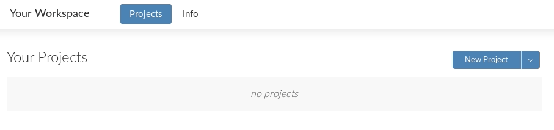
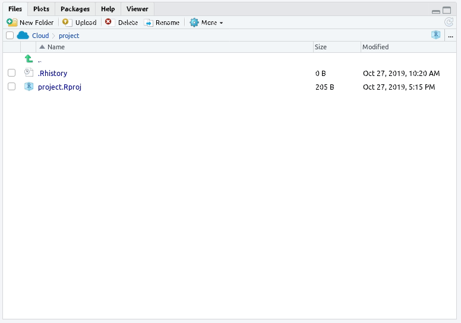

# (APPENDIX) Appendices {-} 

# RStudio Cloud {#cloud}

Sometimes R might not work well on our own computers. However, there is an online version of R Studio (R Studio Cloud) which can be used in a pinch. Using R Studio Cloud is a little different to R Studio, so we have made a short guide to get you up and running.

Please take a minute to read the  [GDPR guidance](https://rstudio.com/about/rstudio-and-the-gdpr-what-you-need-to-know/) for using RStudio Cloud.

## Creating an Account

Head to [RStudio Cloud](https://rstudio.cloud/) and click "Sign Up" at the top of the page


Enter details you wish to sign in with and select "Sign up"


You'll receive an e-mail at the address you sign up with, make sure to click the link to activate your account fully.

## Accessing RStudio Cloud

Head back to [RStudio Cloud](https://rstudio.cloud/) and select "log In", where we previously chose "Sign Up"


Once logged in, you'll be taken to the "Your Workspace" page, this is where all of your RStudio Cloud projects will be accessible from 

Select "New Project" and then "New Project" again



You will see the message "Deploying Project" for a couple of minutes while it creates your Workspace


## Getting Started with RStudio Cloud

Once loaded, you'll see a page that looks almost identical to the other screenshots in the learning material

### Naming the Workspace

Let's give the project a better name!

Click on "Untitled Project" at the top of the page


This will allow you to rename to whatever you like, in this case we'll go for "Network Training"

Press the return key on your keyboard, or click on a different area on the page to complete the task

### Uploading Files

Since this is on the web, files on your computer won't be immediately accessible to RStudio Cloud, you will need to upload them yourself

Click the "Upload" button on the Files tab



An "Upload Files" element will load up where you can click "Browse" and select the file(s) you wish to make available to RStudio Cloud


Once you have selected a file and chosen "OK", you'll be taken back to the main application and you will now see the file you uploaded


You can now interact with this file as described in the rest of the learning material!

# Homework instructions

Just like you've done throughout this book so far, we're going to use R Markdown for the homework worksheets.

**There are just a couple of important rules we need you to follow to make sure this all runs smoothly.**

1. These worksheets will ask you to fill in your answers and not change any other information. For example, if we ask you to replace NULL with your answer, only write in the code you are giving as your answer and nothing else. To illustrate -

**Task 1 read in your data**

```{r example 1} 
data <- NULL
```

The task above is to read in the data file we are using for this task - the correct answer is ```data <- read_csv(data.csv)```. You would replace the NULL with:

**Solution to Task 1**  

```{r example 2, eval = FALSE} 
data <- read_csv("data.csv")
```

This means that we can look for your code and if it is in the format we expect to see it in, we can give you the marks! If you decide to get all creative on us then we can't give you the marks as 'my_work_Nov_2018.csv' isn't the filename we have given to you to use. So don't change the file, variable or data frame names as we need these to be consistent. 

2. We will look for your answers within the boxes which start and end with ``` and have {r task name} in them e.g. 

```{r tidyverse, eval = FALSE, verbatim = 'r tidyverse, messages=FALSE'}

library(tidyverse)
```

These are called code chunks and are the part of the worksheet that we can read and pick out your answers. If you change these in any way we can't read your answer and therefore we can't give you marks. You can see in the example above that the code chunk (the grey zone), starts and ends with these back ticks (usually found on top left corner of the keyboard). This code chunk has the ticks and text which makes it the part of the worksheet that will contain code. The {r tidyverse} part tells us which task it is (e.g., loading in tidyverse) and therefore what we should be looking for and what we can give marks for - loading in the package called tidyverse in the example above. If this changes then it won't be read properly, so will impact on your grade.

The easiest way to use our worksheets is to think of them as fill-in-the-blanks and keep the file names and names used in the worksheet the same. If you are unsure about anything then use the forums on Moodle and Teams to ask any questions. 

