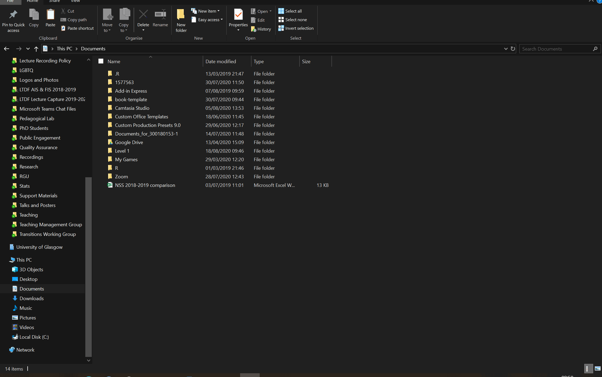

# Getting to know the data

This semester we will use the same dataset each week to develop your skills and knowledge. The dataset is from Woodworth et al. (2018)  and you can find an explanation of the data here [Web-based Positive Psychology Interventions: A Reexamination of Effectiveness](https://openpsychologydata.metajnl.com/articles/10.5334/jopd.35/).

## Activity 1

Read through the study to familiarise yourself with the data you will be using over the coming weeks and answer the below questions.

When you get the correct answer, the answer box will turn green. Sometimes this doesn't work on Internet Explorer or Edge so be sure to use Chrome or Firefox.

* What does the AHI measure? (Hint, use a single word)

<input class='solveme nospaces' size='9' data-answer='["Happiness","happiness","TRUE"]'/> 

* What does the CES-D measure? (hint, use a single word)

<input class='solveme nospaces' size='10' data-answer='["Depression","depression","TRUE"]'/>

* How many participants were there in this study?

<input class='solveme nospaces' size='3' data-answer='["295"]'/>

* How many questions (items) are there on the AHI?

<input class='solveme nospaces' size='2' data-answer='["24"]'/>

* How many questions (items) are there on the CES-D?

<input class='solveme nospaces' size='2' data-answer='["20"]'/>

## Activity 2

<a href="files/1a_files.zip" download>Download the files for Psych 1A here</a>

The files are stored in a **zip file"". A zip file is a folder that contains files that have been compressed to make the file size smaller (like vacuum packed food) and enables you to download multiple files at once, however, before you use the files from a zip folder you first need to extract them.

1. If you haven't already, make a folder on your computer for Psych 1A and then make two additional sub-folders called "Data Skills" and "Academic Writing".
2. Click on the above link to download the folder and save it in your Downloads folder.
3. Navigate to the zip file and open it. You will see all the files it contains but **don't use these** - click **"Extract all"** on the top ribbon.
4. You will be asked to select a location to save the unzipped files. Browse to your 1A Data Skills folder you create in step 1 and select this folder.
5. You can now delete the zip file and use the unzipped files. This is a really important step - if you use the compressed files your code may not work properly.

(\#fig:unnamed-chunk-1)Unzipping a folder

## Activity 3

Now that you've unzipped the folder, you should see that you have eight files. Three of these files are the data from Wodworth et al. -  `code-book.pdf`, `ahi-cesd.csv` and `participant-info.csv`. Open and review each of these files and use the code book to figure out what the data in each variable (column) represents.

* How many variables/columns data does `participant-info.csv` have?

<input class='solveme nospaces' size='1' data-answer='["6"]'/>

* How many variables/columns data does `ahi-cesd.csv` have?

<input class='solveme nospaces' size='2' data-answer='["50"]'/>

* What does a response of 1 for sex mean? <select class='solveme' data-answer='["female"]'> <option></option> <option>female</option> <option>male</option></select>

The remaining five files are "stub files" that you will use as you work through this book, so don't worry about them just now. 

