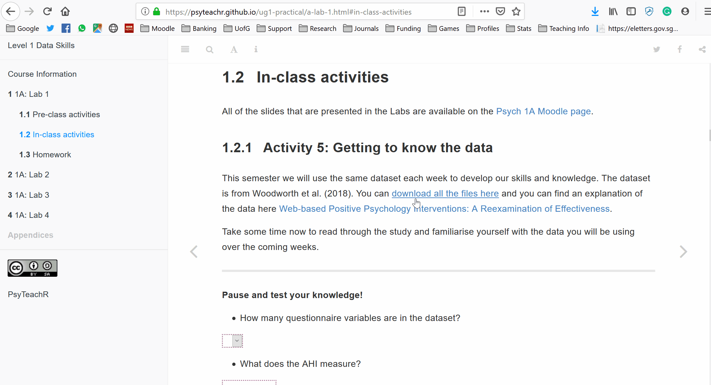
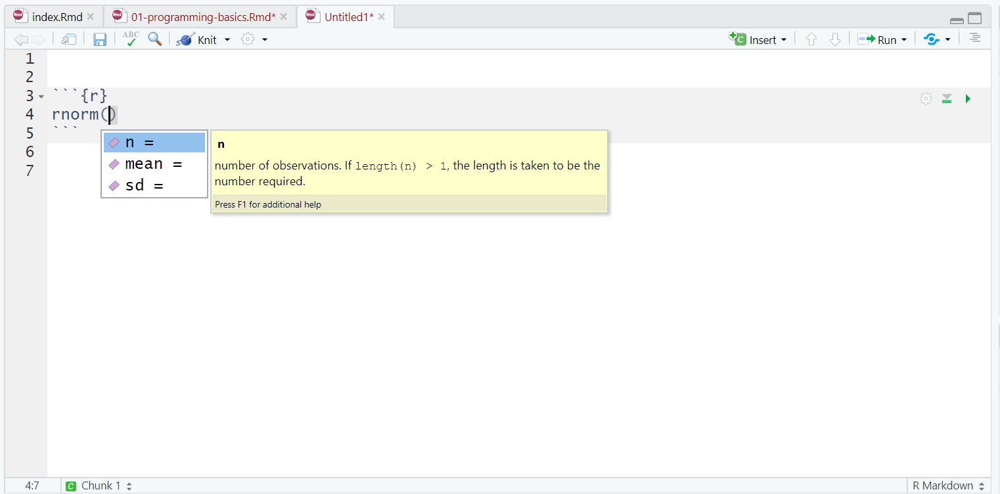
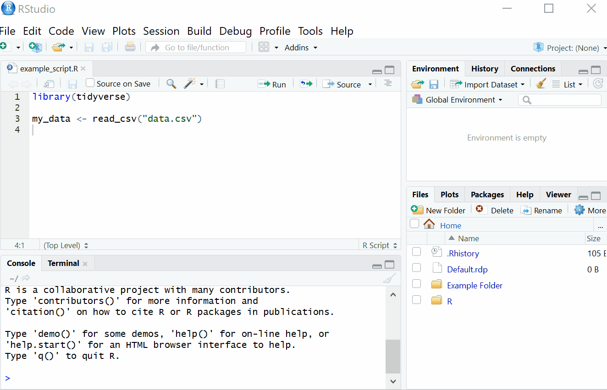

# 1A: Lab 1 

<div class="info">
<p>In this lab you will be introduced to the skills you will develop over the next year and beyond. This lab will introduce open science and why it is relevant to your development as a Psychologist. You will meet your groups and the staff that will be leading your labs and who you will get to know well over the two semesters. We can’t wait to get started!</p>
</div>

## Pre-class activities

Before we get started learning about psychology, it's useful to do a few admin jobs to make sure that you're getting all the information you need and the best experience possible.

### Activity 1: Make sure you know your University username and password and have your student ID card.

This may seem a bit simple however, there's nothing worse than turning up to a lab and not being able to access the computers. Make sure that you know your username and password and consider using a [password manager](https://www.techradar.com/uk/news/software/applications/the-best-password-manager-1325845) so that you don't need to remember it yourself. If something has gone wrong and your account isn't working or if you've forgotten your password you can find the [IT help support for students here](https://www.gla.ac.uk/myglasgow/it/forstudents/). You will also need to bring your student card to the labs as we will scan it to take attendance. If you have lost your card you can find out how to [get a replacement here](https://www.gla.ac.uk/myglasgow/students/sset/idcards/). 

### Activity 2: Set-up your university e-mail on your phone

Setting up your University e-mail on your phone is one of the most important things you can do to make sure you know what is going on. When we contact you, it will be through your University e-mail, and when you contact us you should use this e-mail so that we can verify your identity. Please do not use your personal gmail/hotmail etc. e-mail addresses. 

You need to make sure that you check your e-mail at least once a day. Failing to read the information we send you is not a valid excuse for missing something so if you have your email on your phone with push notifications enabled it makes it much more likely that you will do this. You can find instructions for how to [set up your email on your phone here](https://www.gla.ac.uk/myglasgow/it/studentemail/setupdevice/). You may find that you get a lot of e-mails as you progress through University. Please **do not** turn off your e-mail or turn off e-mails from Moodle because you will miss information. Instead, [you can use folders and rules](https://support.office.com/en-us/article/manage-email-messages-by-using-rules-c24f5dea-9465-4df4-ad17-a50704d66c59) to help organise your inbox (e.g., you can set a rule that all emails from a mailing list go to a specific folder rather than your inbox to help keep things tidy).

### Activity 3: Be social

If you have a Twitter or Facebook account you may find it helpful to follow the School accounts. On Facebook we have a [Level 1 group](https://www.facebook.com/groups/psych2023/) so that you can contact other students. On Twitter, you can follow the [School of Psychology](https://twitter.com/UofGPsychology) account, but many of your 1st year lecturers and GTAs are also active on Twitter and you may find it interesting to follow them as well - [Emily Nordmann](https://twitter.com/emilynordmann), [Niamh Stack](https://twitter.com/Eavanmac), [Heather Cleland-Woods](https://twitter.com/clelandwoods), [Helena Paterson](https://twitter.com/PatersonHelena), [Holly Scott](https://twitter.com/hollyscott248), [Steven McNair](https://twitter.com/stevenwmcnair), [Jude Stevenson](https://twitter.com/william_the_sir), [Carolina Kuepper-Tetzel](https://twitter.com/pimpmymemory).

OK, let's start talking about psychology.


### The replication crisis 

There is an ongoing debate within Psychology regarding whether the discipline is experiencing a **replication crisis**. When we say **replication** we mean the extent to which **consistent results** are obtained when we repeat an experiment under **comparable conditions**. So, when we say replication **crisis** we mean that efforts to replicate past study findings often do not show the same results. For example, in 2015, a [team of researchers](https://www.nature.com/articles/s41562-018-0399-z) examined social science experiments published in the academic journals _Nature_ and _Science_ between 2010 and 2015. Out of 21 experiments, 13 were successfully replicated. 

**Why is this happening?**

When conducting research, you have to ask yourself a lot of questions: How many participants will I recruit? What variables am I interested in? What's the best way to analyse my data? This is called **researcher degrees of freedom**. This means researchers often have a lot of flexibility and can approach data in a "have a look" manner. Crucially, researcher degrees of freedom can lead to researchers using **questionable research practices** such as: 

* Failing to report all of a study's dependent measures (e.g what you measure in the experiment)
* Collecting more data after peeking at your results in order to make your results turn out the way you wanted 
* Failing to report all conditions in a study (e.g. Collecting data from three conditions - no/low/high anxiety - but only reporting two)
* Stopping data collection earlier than planned because you found results you wanted
* Only reporting studies that "worked"
* HARKing - Hypothesising After Results Are Known (e.g. claiming you **predicted** these results before collecting data)

In some cases, researchers have even been known to [falsify](https://www.sciencemag.org/news/2012/09/harvard-psychology-researcher-committed-fraud-us-investigation-concludes) their data. 

A related concept is **reproducibility**. If research is reproducible it means someone else could take the information provided by the authors (e.g., data, method section, analysis code) and reproduce their results. This may sound like it should be easy enough to do, but as you'll learn about in class and throughout the lectures, this is very difficult, partially because often researchers have not shared their data or code.


**Why should I care?**

Science does not occur in a vacuum. Work that is published and disseminated then goes on to influence public knowledge (e.g. through reporting in the media) and the decisions our politicians make every day.  

**What can be done about it?**

During your time here at Glasgow, we will support you in developing skills and experience in **open science** practices. Open science practices are actions which aim to improve the **transparency**, **accessibility**, and **reproducibility** of scientific research. 

### Activity 4: Open science video

Watch this [video](https://www.youtube.com/watch?v=1rFWeTryiW4&feature=youtu.be) of [Dr Simine Vazire](https://twitter.com/siminevazire?ref_src=twsrc%5Egoogle%7Ctwcamp%5Eserp%7Ctwgr%5Eauthor) talking about open science and why it is an important concept for us to understand in Psychology.  

#### Additional resources around open science and reproducibility 

[Is most published research wrong?](https://youtu.be/42QuXLucH3Q)

[Replicability and Reproducibility Debate with Professor Dorothy Bishop](https://www.youtube.com/watch?v=UN8jgyXtz6A)

[Why an Entire Field of Psychology Is in Trouble](https://youtu.be/2MDNvKXdLEM)

[Beyond Cherry-picking](https://socialsciences.nature.com/users/200472-amy-orben/posts/42763-beyond-cherry-picking) by [Amy Orben](https://twitter.com/orbenamy?lang=en)

******

## In-class activities

All of the slides that are presented in the Labs are available on the [Psych 1A Moodle page](https://moodle.gla.ac.uk/course/view.php?id=16358).

### Activity 5: Getting to know the data

This semester we will use the same dataset each week to develop our skills and knowledge. The dataset is from Woodworth et al. (2018). You can <a href="files/1a_data.zip" download>download all the files here</a> and you can find an explanation of the data here [Web-based Positive Psychology Interventions: A Reexamination of Effectiveness](https://openpsychologydata.metajnl.com/articles/10.5334/jopd.35/).

Take some time now to read through the study and familiarise yourself with the data you will be using over the coming weeks.  

#### How to use zip files

In this course we will often ask you to download a folder with multiple files and this will be stored on the server as a zip file. A zip file is a folder that contains files that have been compressed to make the file size smaller and enables you to download multiple files at once, however, before you use the files from a zip folder you first need to extract them.

1. Click on the link to download the folder and select to save the zip file in your lab 1 folder.
2. Navigate to the zip file and open it. You will see all the files it contains but don't use these - click "Extract all" on the top ribbon.
3. You will be asked to select a location to save the unzipped files. Normally the default location it suggests will be the same folder and so you can just click "Extract".
4. You can now delete the zip file and use the unzipped files. This is a really important step - if you use the compressed files your code may not work properly.


<div class="figure" style="text-align: center">

<p class="caption">(\#fig:unnamed-chunk-3)Unzipping a folder</p>
</div>

******

**Pause and test your knowledge!**

When you get the correct answer, the answer box will turn green. Sometimes this doesn't work on Internet Explorer or Edge so be sure to use Chrome or Firefox.

* What does the AHI measure? (Hint, use a single word)

<input class='solveme nospaces' size='9' data-answer='["Happiness","happiness","TRUE"]'/> 

* What does the CES-D measure? (hint, use a single word)

<input class='solveme nospaces' size='10' data-answer='["Depression","depression","TRUE"]'/>

******

**In groups, have a think about what a possible research question might look like. How would you use this data? Would you be interested in studying any other variables alongside the data that you have?**

## Homework

For the homework this week, we will go over some basic programming concepts and terminology, common pitfalls, helpful hints, and where to get help. Those of you who have no programming experience should find this chapter particularly helpful, however, even if you've used R before there may be some helpful hints and tips so please make sure you read through this chapter before the lab.

You do not need to formally submit this homework but we will check that you've done it in the next lab!

This is a long chapter but we don't expect you to memorise all the information that is contained in it and some sections of it will make not make sense until you start writing your own code in the lab - just make sure you know what help is available!

### Why are you teaching me programming?? I signed up for psychology not computer science!!

Research methods and statistics is a large part of doing a psychology degree. In fact, it's so important for your understanding of psychology that it's one of the core areas that the British Psychological Society require for you to graduate with an accredited degree. Unfortunately, many students don't realise that this is a part of psychology until the first week of lectures and for some people it comes as a bit of a shock. 

But! There is no need to worry. With both statistics and programming we're going to start from the very beginning and develop your skills slowly over the next three years. The skills that you learn from this course will allow you to read research papers, design, conduct and analyse both qualitative and quantitative studies, evaluate research in all its forms (even fake news), and make some pretty fancy visualisations. Even if you don't plan on a career in research, the transferable skills that you develop from this course will make you an employable and versatile graduate.

The reason that we're going to teach you how to do statistics and manage data using R is because of the issues we've been discussing regarding replication and reproducibility. Writing code is essentially like writing a fool-proof recipe. You can give other people (or just you after a long holiday) your raw data and code and they'll be able to see exactly what you did, step-by-step with nothing missing. R is just the tool we will use to teach you how to do reproducible science so that you won't make the same mistakes we did and so that psychological research will keep on improving.

Right. Let's begin.

### R and R Studio

For this course, you need two different bits of software, [R](https://www.r-project.org/) and [RStudio](https://www.rstudio.com/products/rstudio/download/#download). R is a programming language that you will write code in and R Studio is an Integrated Development Environment (IDE) which makes working with R easier. Think of it as knowing English and using a plain text editor like NotePad to write a book versus using a word processor like Microsoft Word. You could do it, but it wouldn't look as good and it would be much harder without things like spell-checking and formatting. In a similar way, you can use R without R Studio but we wouldn't recommend it. The key thing to remember is that although you will do all of your work using R Studio for this course, you are actually using two pieces of software which means that from time-to-time, both of them may have separate updates.

All of the University of Glasgow computers have R and R Studio installed, however, we can only guarantee that the computers in the Level 5 and 6 Boyd Orr psychology labs have the right set-up. Additionally, both are freely available so you may wish to install them on your own machine. There is a useful [guide to installing them both here](https://psyteachr.github.io/hack-your-data/r_instructions.html) that you can use but if you need help wig this you can attend one of the PAL sessions or practice sessions (check your e-mails for details of when these run).

Most computers will install R without any problems, however, if your computer cannot run it (for example, if you have a notebook lapatop), there is a browser version of R and you can find instructions for how to use this in Appendix \@ref(cloud)

### Getting to know R Studio

R Studio has a console that you can try out code in (appearing as the bottom left window in Figure \@ref(fig:img-rstudio)), there is a script editor (top left), a window showing functions and objects you have created in the “Environment” tab (top right window in the figure), and a window that shows plots, files packages, and help documentation (bottom right).

<div class="figure" style="text-align: center">

<p class="caption">(\#fig:img-rstudio)RStudio interface</p>
</div>

You will learn more about how to use the features included in R Studio throughout this course, however, we highly recommend watching [RStudio Essentials 1](https://www.rstudio.com/resources/webinars/rstudio-essentials-webinar-series-part-1/) from the R Studio team. The video lasts ~30 minutes and gives a tour of the main parts of R Studio. 

### Functions and arguments

**Functions** in R execute specific tasks and normally take a number of **arguments** (if you're into linguistics you might want to think as these as verbs that require a subject and an object). You can look up all the arguments that a function takes by using the help documentation by using the format `?function`. Some arguments are required, and some are optional. Optional arguments will often use a default (normally specified in the help documentation) if you do not enter any value.

As an example, let’s look at the help documentation for the function `rnorm()` which randomly generates a set of numbers with a normal distribution. 

### Activity 1

* Open up R Studio and in the console, type the following code:  


```r
?rnorm
```

The help documentation for `rnorm()` should appear in the bottom right help panel. In the usage section, we see that `rnorm()` takes the following form:


```r
rnorm(n, mean = 0, sd = 1)
```

In the arguments section, there are explanations for each of the arguments. `n` is the number of observations we want to create, `mean` is the mean of the data points we will create and `sd` is the standard deviation of the set. In the details section it notes that if no values are entered for `mean` and `sd` it will use a default of 0 and 1 for these values. Because there is no default value for `n` it must be specified otherwise the code won't run.

Let's try an example and just change the required argument `n` to ask R to produce 5 random numbers. 

### Activity 2

* Copy and paste the following code into the console.  


```r
set.seed(12042016)
rnorm(n = 5)
```

```
## [1] -0.2896163 -0.6428964  0.5829221 -0.3286728 -0.5110101
```

These numbers have a mean of 0 and an SD of 1. Now we can change the additional arguments to produce a different set of numbers.


```r
rnorm(n = 5, mean = 10, sd = 2)
```

```
## [1] 13.320853  9.377956 10.235461  9.811793 13.019102
```

This time R has still produced 5 random numbers, but now this set of numbers has a mean of 10 and an sd of 2 as specified. Always remember to use the help documentation to help you understand what arguments a function requires.


<div class="info">
<p>If you’re looking up examples of code online, you may often see code that starts with the function <code>set.seed()</code>. This function controls the random number generator - if you’re using any functions that generate numbers randomly (such as <code>rnorm()</code>), running <code>set.seed()</code> will ensure that you get the same result (in some cases this may not be what you want to do). We call <code>set.seed()</code> in this example because it means that you will get the same random numbers as this book.</p>
</div>

### Argument names

In the above examples, we have written out the argument names in our code (e.g., `n`, `mean`, `sd`), however, this is not strictly necessary. The following two lines of code would both produce the same result (although each time you run `rnorm()` it will produce a slightly different set of numbers, because it's random, but they would still have the same mean and SD):


```r
rnorm(n = 6, mean = 3, sd = 1)
rnorm(6, 3, 1)
```

Importantly, if you do not write out the argument names, R will use the default order of arguments, that is for `rnorm` it will assume that the first number you enter is `n`. the second number is `mean` and the third number is `sd`. 

If you write out the argument names then you can write the arguments in whatever order you like:


```r
rnorm(sd = 1, n = 6, mean = 3)
```

When you are first learning R, you may find it useful to write out the argument names as it can help you remember and understand what each part of the function is doing. However, as your skills progress you may find it quicker to omit the argument names and you will also see examples of code online that do not use argument names so it is important to be able to understand which argument each bit of code is referring to (or look up the help documentation to check).

In this course, we will always write out the argument names the first time we use each function, however, in subsequent uses they may be omitted.

### Tab auto-complete

One very useful feature of R Studio is the tab auto-complete for functions (see Figure \@ref(fig:img-autocomplete)). If you write the name of the function and then press the tab key, R Studio will show you the arguments that function takes along with a brief description. If you press enter on the argument name it will fill in the name for you, just like auto-complete on your phone. This is incredibly useful when you are first learning R and you should remember to use this feature frequently. 

<div class="figure" style="text-align: center">

<p class="caption">(\#fig:img-autocomplete)Tab auto-complete</p>
</div>

### Base R and packages {#packages}

When you install R you will have access to a range of functions including options for data wrangling and statistical analysis. The functions that are included in the default installation are typically referred to as **Base R** and there is a useful cheat sheet that shows many Base R functions [here](https://www.rstudio.com/wp-content/uploads/2016/05/base-r.pdf).

However, the power of R is that it is extendable and open source - put simply, if a function doesn't exist or doesn't work very well, anyone can create a new **package** that contains data and code to allow you to perform new tasks. You may find it useful to think of Base R as the default apps that come on your phone and packages as additional apps that you need to download separately.

### Installing and loading packages

<div class="info">
<p>The Boyd Orr psychology computers will already have all of the packages you need for this course so you only need to install packages if you are using your own machine. <strong>Please do not install any packages on the university machines.</strong></p>
</div>


### Activity 3: Install the tidyverse

In order to use a package, you must first install it. The following code installs the package `tidyverse`, a package we will use very frequently in this course.

* If you are working on your own computer, use the below code to install the tidyverse. **Do not do this if you are working on a University machine**.  


```r
install.packages("tidyverse")
```

You only need to install a package once, however, each time you start R you need to load the packages you want to use, in a similar way that you need to install an app on your phone once, but you need to open it every time you want to use it.

To load packages we use the function `library()`. Typically you would start any analysis script by loading all of the packages you need, but we will come back to that in the labs.

### Activity 4: Load the tidyverse

* Run the below code to load the tidyverse. You can do this regardless of whether you are using your own computer or a University machine.  


```r
library(tidyverse)
```

You will get what looks like an error message - it's not. It's just R telling you what it's done.

Now that we've loaded the `tidyverse` package we can use any of the functions it contains but remember, you need to run the `library()` function every time you start R.


### Package updates

In addition to updates to R and R Studio, the creators of packages also sometimes update their code. This can be to add functions to a package, or it can be to fix errors. One thing to avoid is unintentionally updating an installed package. When you run `install.packages()` it will always install the latest version of the package and it will overwrite any older versions you may have installed. Sometimes this isn't a problem, however, sometimes you will find that the update means your code no longer works as the package has changed substantially. It is possible to revert back to an older version of a package but try to avoid this anyway.

<div class="danger">
<p>To avoid accidentally overwriting a package with a later version, you should <strong>never</strong> include <code>install.packages()</code> in your analysis scripts in case you, or someone else runs the code by mistake. Remember, the Boyd Orr psychology computers will already have all of the packages you need for this course so you only need to install packages if you are using your own machine.</p>
</div>

### Package conflicts {#conflicts}

There are thousands of different R packages with even more functions. Unfortunately, sometimes different packages have the same function names. For example, the packages `dplyr` and `MASS` both have a function named `select()`. If you load both of these packages, R will produce a warning telling you that there is a conflict.


```r
library(dplyr)
library(MASS)
```

```
## Warning: package 'MASS' was built under R version 3.6.2
```

```
## 
## Attaching package: 'MASS'
```

```
## The following object is masked from 'package:dplyr':
## 
##     select
```

In this case, R is telling you that the function `select()` in the `dplyr` package is being hidden (or 'masked') by another function with the same name. If you were to try and use `select()`, R would use the function from the package that was loaded most recently - in this case it would use the function from `MASS`.

If you want to specify which package you want to use for a particular function you can use code in the format `package::function`, for example:


```r
dplyr::select()
MASS::select()
```

### Objects

A large part of your coding will involve creating and manipulating objects. Objects contain stuff. That stuff can be numbers, words, or the result of operations and analyses.You assign content to an object using `<-`.

### Activity 5: Create some objects

* Copy and paste the following code into the console, change the code so that it uses your own name and age and run it. You should see that `name`, `age`, `today`, `new_year`, and `data` appear in the environment pane.  


```r
name <- "emily"
age <- 15 + 18 
today <-Sys.Date()
new_year <- as.Date("2020-01-01")
data <- rnorm(n = 10, mean = 15, sd = 3)
```

<div class="figure" style="text-align: center">

<p class="caption">(\#fig:img-objects-enviro)Objects in the environment</p>
</div>

Note that in these examples, `name`,`age`, and `new_year` would always contain the values `emily`, `33`, and the date of New Year's Day 2020, however, `today` will draw the date from the operating system and `data` will be a randomly generated set of data so the values of these objects will not be static.

As a side note, if you ever have to teach programming and statistics, don't use your age as an example because everytime you have to update your teaching materials you get a reminder of the fragility of existence and your advancing age. 

Importantly, objects can be involved in calculations and can interact with each other. For example:


```r
age + 10
new_year - today
mean(data)
```

```
## [1] 43
## Time difference of -98 days
## [1] 17.66644
```

Finally, you can store the result of these operations in a new object:


```r
decade <- age + 10
```

<div class="try">
<p>You may find it helpful to read <code>&lt;-</code> as <code>contains</code>, e.g., <code>name</code> contains the text <code>emily</code>.</p>
</div>

You will constantly be creating objects throughout this course and you will learn more about them and how they behave as we go along, however, for now it is enough to understand that they are a way of saving values, that these values can be numbers, text, or the result of operations, and that they can be used in further operations to create new variables.

<div class="info">
<p>You may also see objects referred to as ‘variables’. There is a difference between the two in programming terms, however, they are used synonymously very frequently.</p>
</div>

### Looking after the environment

If you've been writing a lot of code you may find that the environment pane (or workspace) has become cluttered with many objects. This can make it difficult to figure out which object you need and therefore you run the risk of using the wrong data frame. If you're working on a new dataset, or if you've tried lots of different code before getting the final version, it is good practice to remember to clear the environment to avoid using the wrong object. You can do this in several way.

1. To remove individual objects, you can type `rm(object_name)` in the console. Try this now to remove one of the objects you created in the previous section. 
2. To clear all objects from the environment run `rm(list = ls())` in the console.
3. To clear all objects from the environment you can also click the broom icon in the environment pane. 


<div class="figure" style="text-align: center">

<p class="caption">(\#fig:img-broom)Clearing the workspace</p>
</div>

### Setting the working directory

What this means is that we need to tell R where the files we need are located. Think of it just like when you have different subjects, and you have separate folders for each topic e.g. biology, history and so on. When working on R, it's useful to have all the data sets and files you need in one folder.

To set the working directory press session -> set working directory -> choose directory and then select the folder where the data sets we are working on are saved, and save this file in the same folder as well. In other words- make sure your data sets and scripts are all in the same folder. In the labs, we recommend that you create a folder for your Psychology labs with sub-folders for the tutorial and data skills sections on your M: drive. This is your personal area on the University network that is safe and secure so is much better than flashdrives or desktops. You can access your M drive by logging into any computer on the University network.

<div class="figure" style="text-align: center">

<p class="caption">(\#fig:unnamed-chunk-10)Setting your working directory</p>
</div>

### Activity 6: Set the working directory

* Create a new folder for Psych 1A on your M:Drive and then two sub-folders called Tutorial and Data Skills. Following the above instructions, set your working directory to your Data Skills folder.  

### R sessions

When you open up R and start writing code, loading packages, and creating objects, you're doing so in a new **session**. In addition to clearing the workspace, it can sometimes be useful to start a new session. This will happen automatically each time you start R, however, if you find your code isn't working and you can't figure out why, it might be worth starting a new session. This will clear the environment and detach all loaded packages - think of it like restarting your phone.

To do this, click 'Session - Restart R'. Remember that you will then need to load the packages you need and your data again. 

<div class="figure" style="text-align: center">

<p class="caption">(\#fig:img-session)The truth about programming</p>
</div>

### Help and additional resources

<div class="figure" style="text-align: center">

<p class="caption">(\#fig:img-kitteh)The truth about programming</p>
</div>

Getting good at programming really means getting good trying stuff out,  searching for help online, and finding examples of code to copy. If you are having difficulty with any of the exercises contained in this book then you can ask for help on Slack or Moodle, however, learning to problem-solve effectively is a key skill that you need to develop throughout this course. 

* Use the help documentation. If you're struggling to understand how a function works, remember the `?function` command.
* If you get an error message, copy and paste it in to Google - it's very likely someone else has had the same problem.
* In addition to these course materials there are a number of excellent resources for learning R:
  * [R Cookbook](http://www.cookbook-r.com/)
  * [StackOverflow](https://stackoverflow.com/)
  * [R for Data Science](https://r4ds.had.co.nz/)
  * Search or use the [#rstats](https://twitter.com/search?f=tweets&q=%23rstats&src=typd) hashtag on Twitter


### Debugging tips

A large part of coding is trying to figure why your code doesn't work and this is true whether you are a novice or an expert. As you progress through this course  you should keep a record of mistakes you make and how you fixed them. In each chapter we will provide a number of common mistakes to look out for but you will undoubtedly make (and fix!) new mistakes yourself.

* Have you loaded the correct packages for the functions you are trying to use? One very common mistake is to write the code to load the package, e.g., `library(tidyverse)` but then forget to run it.
* Have you made a typo? Remember `data` is not the same as `DATA` and `t.test` is not the same as `t_test`.
* Is there a package conflict? Have you tried specifying the package and function with `package::function`?
* Is it definitely an error? Not all red text in R means an error - sometimes it is just giving you a message with information. 

### Activity 7: Test yourself

**Question 1.** Why should you never include the code `install.packages()` in your analysis scripts? <select class='solveme' data-answer='["You (or someone else) may accidentally install a package update that stops your code working"]'> <option></option> <option>You should use library() instead</option> <option>Packages are already part of Base R</option> <option>You (or someone else) may accidentally install a package update that stops your code working</option> <option>You already have the latest version of the package</option></select> 


<div class='solution'><button>Explain This Answer</button>

Remember, when you run `install.packages()` it will always install the latest version of the package and it will overwrite any older versions of the package you may have installed.

</div>
 
<br>
**Question 2.**What will the following code produce?
  

```r
rnorm(6, 50, 10)
```

<select class='solveme' data-answer='["A dataset with 6 numbers that has a mean of 50 and an SD of 10"]'> <option></option> <option>A dataset with 10 numbers that has a mean of 6 and an SD of 50</option> <option>A dataset with 6 numbers that has a mean of 50 and an SD of 10</option> <option>A dataset with 50 numbers that has a mean of 10 and an SD of 6</option> <option>A dataset with 50 numbers that has a mean of 10 and an SD of 6</option></select>  


<div class='solution'><button>Explain This Answer</button>

The default form for `rnorm()` is `rnorm(n, mean, sd)`. If you need help remembering what each argument of a function does, look up the help documentation by running `?rnorm`

</div>
  
<br>
**Question 3.** If you have two packages that have functions with the same name and you want to specify exactly which package to use, what code would you use? 

<select class='solveme' data-answer='["package::function"]'> <option></option> <option>package::function</option> <option>function::package</option> <option>library(package)</option> <option>install.packages(package)</option></select>  


<div class='solution'><button>Explain This Answer</button>

You should use the form `package::function`, for example `dplyr::select`. Remember that when you first load your packages R will warn you if any functions have the same name - remember to look out for this!

</div>
  

**Question 4.** Which of the following is most likely to be an argument? <select class='solveme' data-answer='["35"]'> <option></option> <option>35</option> <option>read_csv()</option> <option><-</option></select>

**Question 5.** An easy way to spot functions is to look for <select class='solveme' data-answer='["brackets"]'> <option></option> <option>brackets</option> <option>numbers</option> <option>computers</option></select>.

**Question 6.** The job of `<-` is to send the output from the function to a/an <select class='solveme' data-answer='["object"]'> <option></option> <option>argument</option> <option>assignment</option> <option>object</option></select>.


