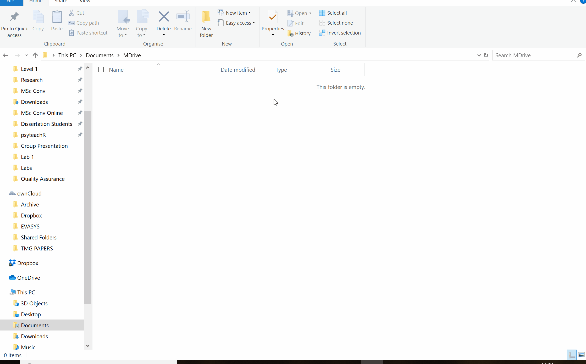
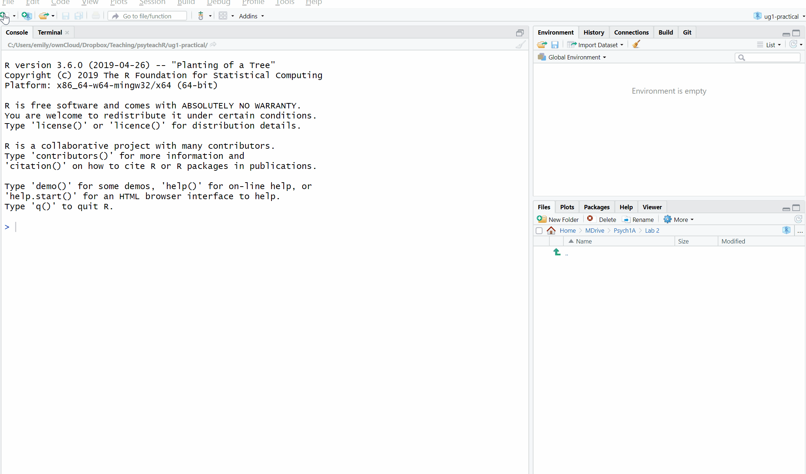
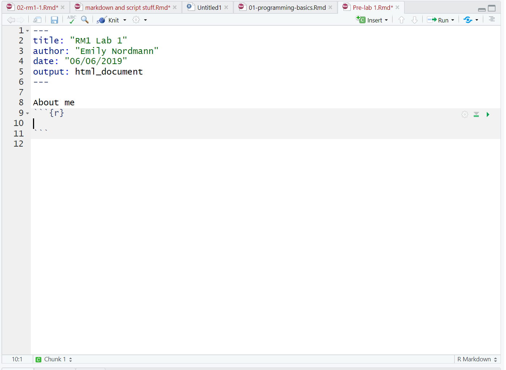
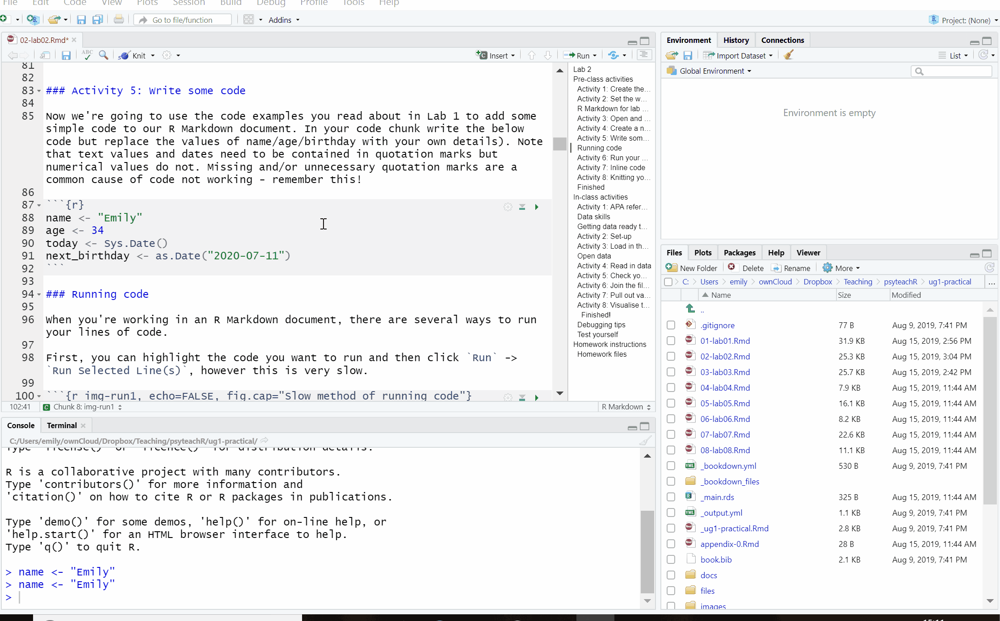

# 1A: Lab 2

## Pre-class activities {#ref1}

There are eight activities in total for this pre-class, but don't worry, they are broken down into very small steps!

### Activity 1: Create the working directory 

If you want to load data into R, or save the output of what you've created (which you almost always will want to do), you first need to tell R where the **working directory** is. All this means is that we tell R where the files we need (such as raw data) are located and where we want to save any files you have created. Think of it just like when you have different subjects, and you have separate folders for each topic e.g. biology, history and so on. When working with R, it's useful to have all the data sets and files you need in one folder. 

We recommend making a new folder called "Psych 1A" with sub-folders for the tutorial and data skills secctions of the labs and saving any slides, activities, data, scripts, and homework files in these folders. We suggest that you create these folders on the M: drive. This is your personal area on the University network that is safe and secure so it is much better than flashdrives or desktops. 


<div class="figure" style="text-align: center">

<p class="caption">(\#fig:img-folders)Folder structure</p>
</div>

* Choose a location for your lab work and then create the necessary folders.

<div class="warning">
<p>Whatever you do, do NOT call the folder you store your R work in “R”. You don’t have to call it Data Skills, but if you call it simply R then R will have an existential crisis about saving into itself and you will find that you have problems reading and saving your files.</p>
</div>

### Activity 2: Set the working directory

Once you have created your folders, open R Studio. To set the working directory click `Session` -> `Set Working Directory` -> `Choose Directory` and then select the Data Skills folder as your working directory. 


### R Markdown for lab work and homework assignments

For the lab work and homework you will use a worksheet format called R Markdown (abbreviated as Rmd) which is a great way to create dynamic documents with embedded chunks of code. These documents are self-contained and fully reproducible (if you have the necessary data, you should be able to run someone else's analyses with the click of a button) which makes it very easy to share. This is an important part of your open science training as one of the reasons we are using R Studio is that it enables us to share open and reproducible information. Using these worksheets enables you to keep a record of all the code you write during the labs, and when it comes time for the portfolio assignments, we can give you a task you can and then fill in the required code. 

For more information about R Markdown feel free to have a look at their main webpage sometime http://rmarkdown.rstudio.com. The key advantage of R Markdown is that it allows you to write code into a document, along with regular text, and then **knit** it using the package `knitr` to create your document as either a webpage (HTML), a PDF, or Word document (.docx). 

### Activity 3: Open and save a new R Markdown document

To open a new R Markdown document click the 'new item' icon and then click 'R Markdown'. You will be prompted to give it a title, call it "Lab 2 pre-class". Also, change the author name to your GUID as this will be good practice for the homework. Keep the output format as HTML.

Once you've opened a new document be sure to save it by clicking `File` -> `Save as`. You should also name this file "Lab 2 pre-class". If you've set the working directory correctly, you should now see this file appear in your file viewer pane.

<div class="figure" style="text-align: center">

<p class="caption">(\#fig:img-new-markdown)Opening a new R Markdown document</p>
</div>

### Activity 4: Create a new code chunk

When you first open a new R Markdown document you will see a bunch of welcome text that looks like this:

<div class="figure" style="text-align: center">

<p class="caption">(\#fig:img-markdown-default)New R Markdown text</p>
</div>

Do the following steps:  
* Delete **everything** below line 7  
* On line 8 type "About me"  
* Click `Insert` -> `R`  

Your Markdown document should now look something like this:

<div class="figure" style="text-align: center">

<p class="caption">(\#fig:img-new-chunk)New R chunk</p>
</div>

What you have created is a **code chunk**. In R Markdown, anything written in the white space is regarded as normal text, and anything written in a grey code chunk is assumed to be code. This makes it easy to combine both text and code in one document.


<div class="warning">
<p>When you create a new code chunk you should notice that the grey box starts and ends with three back ticks ```. One common mistake is to accidentally delete these back ticks. Remember, code chunks are grey and text entry is white - if the colour of certain parts of your Markdown doesn’t look right, check that you haven’t deleted the back ticks.</p>
</div>


### Activity 5: Write some code

Now we're going to use the code examples you read about in Lab 1 to add some simple code to our R Markdown document. 

* In your code chunk write the below code but replace the values of name/age/birthday with your own details).   
* Note that text values and dates need to be contained in quotation marks but numerical values do not. Missing and/or unnecessary quotation marks are a common cause of code not working - remember this!


```r
name <- "Emily" 
age <- 34
today <- Sys.Date()
next_birthday <- as.Date("2020-07-11")
```

### Running code

When you're working in an R Markdown document, there are several ways to run your lines of code.

First, you can highlight the code you want to run and then click `Run` -> `Run Selected Line(s)`, however this is very slow.

<div class="figure" style="text-align: center">

<p class="caption">(\#fig:img-run1)Slow method of running code</p>
</div>

Alternatively, you can press the green "play" button at the top-right of the code chunk and this will run **all** lines of code in that chunk.

<div class="figure" style="text-align: center">

<p class="caption">(\#fig:img-run2)Slightly better method of running code</p>
</div>

Even better though is to learn some of the keyboard shortcuts for R Studio. To run a single line of code, make sure that the cursor is in the line of code you want to run (it can be anywhere) and press `ctrl + enter`. If you want to run all of the code in the code chunk, press `ctrl + shift + enter`. Learn these shortcuts, they will make your life easier!

### Activity 6: Run your code

Run your code using one of the methods above. You should see the variables `name`, `age`, `today`, and `next_birthday` appear in the environment pane.

### Activity 7: Inline code

An incredibly useful feature of R Markdown is that R can insert values into your writing using **inline code**. If you've ever had to copy and paste a value or text from one file in to another, you'll know how easy it can be to make mistakes. Inline code avoids this. It's easier to show you what inline code does rather than to explain it so let's have a go.

First, copy and paste this text exactly (do not change anything) to the **white space** underneath your code chunk.


```r
My name is `r name` and I am `r age` years old. It is `r next_birthday - today` days until my birthday.
```

### Activity 8: Knitting your file

Nearly finished! As our final step we are going to "knit" our file. This simply means that we're going to compile our code into a document that is more presentable. To do this click `Knit` -> `Knit to HMTL`. R Markdown will create a new HTML document and it will automatically save this file in your working directory. 

As if by magic, that slightly odd bit of text you copied and pasted now appears as a normal sentence with the values pulled in from the objects you created. 

**My name is Emily and I am 34 years old. It is 94 days until my birthday.**

We're not going to use this function very often in the rest of the course but hopefully you can see just how useful this would be when writing up a report with lots of numbers! R Markdown is an incredibly powerful and flexible format - this book was written using it! If you want to push yourself with R, additional functions and features of R Markdown would be a good place to start.

Before we finish, there are a few final things to note about knitting that will be useful for the homework:  

* R Markdown will only knit if your code works - this is a good way of checking for the portfolio assignments whether you've written legal code!  
* You can choose to knit to a Word document rather than HTML. This can be useful for e.g., sharing with others, however, it may lose some functionality and it probably won't look as good so we'd recommend always knitting to HTML.
* You can choose to knit to PDF, however, this requires an LaTex installation and is quite complicated. If you don't already know what LaTex is and how to use it, do not knit to PDF. If you do know how to use LaTex, you don't need us to give you instructions! 
* R will automatically open the knitted HTML file in the viewer, however, you can also navigate to the folder it is stored in and open the HTML file in your web browser (e.g., Chrome or Firefox).  

### Finished

And you're done! On your very first time using R you've not only written functioning code but you've written a reproducible output! You could send someone else your R Markdown document and they would be able to produce exactly the same HTML document as you, just by pressing knit.

The key thing we want you to take away from this pre-class is that R isn't scary. It might be very new to a lot of you, but we're going to take you through it step-by-step. You'll be amazed at how quickly you can start producing professional-looking data visualisations and analysis.

*****

## In-class activities

### Activity 1: APA referencing 

Look at the following reference and answer the below questions:

Smith, M. K., Wood, W. B., Adams, W. K., Wieman, C., Knight, J. K., Guild, N., & Su, T. T. (2009). Why peer discussion improves student performance on in-class concept questions. *Science, 323*(5910), 122-124. https://doi.org/10.1126/science.1165919 

* How many authors are there? <input class='solveme nospaces' size='1' data-answer='["7"]'/>
* What is the name of the journal? <input class='solveme nospaces' size='7' data-answer='["Science","TRUE"]'/>
* How many pages is the article? <input class='solveme nospaces' size='1' data-answer='["3"]'/> 

According to APA style:

* The title of the paper should be <select class='solveme' data-answer='["In normal text"]'> <option></option> <option>In bold text</option> <option>In italics</option> <option>In normal text</option></select>.
* When using a direct in-text citation you should use <select class='solveme' data-answer='["and"]'> <option></option> <option>and</option> <option>&</option></select> to connect the names of the authors.
* When citing a paper with multiple authors, if there are more than two authors the first time you cite the paper in the essay you should <select class='solveme' data-answer='["Write out all of the names"]'> <option></option> <option>Write out all of the names</option> <option>Use et al.</option></select>


<div class='solution'><button>Explain this answer</button>

*Et al* means *and others*. It's a common academic phrase that's used when referring to work with more than three authors.

</div>
 


### Data skills

Part of becoming a psychologist is asking questions and gathering data to enable you to answer these questions effectively. It is very important that you understand all aspects of the research process such as experimental design, ethics, data management and visualisation. 

In this class, you will continue to develop reproducible scripts. This means scripts that completely and transparently perform an analysis from start to finish in a way that yields the same result for different people using the same software on different computers. And transparency is a key value of science, as embodied in the “trust but verify” motto. When you do things reproducibly, others can understand and check your work. 

This benefits science, but there is a selfish reason, too: the most important person who will benefit from a reproducible script is your future self. When you return to an analysis after two weeks of vacation, you will thank your earlier self for doing things in a transparent, reproducible way, as you can easily pick up right where you left off.

As part of your skill development, it is important that you work with data so that you can become confident and competent in your management and analysis of data. In the labs, we will work with real data that has been shared by other researchers. 

### Getting data ready to work with

Today in the lab you will learn how to load the packages required to work with our data. You'll then load the data into R Studio before getting it organised into a sensible format that relates to our research question. If you can't remember what packages are, go back and revise \@ref(packages). 

### Activity 2: Set-up

Before we begin working with the data we need to do some set-up. If you need help with any of these steps, you should refer to Chapter \@ref(ref1): 

* You should have already download the data files as part of Activity 5 in Lab 1, however, here they are again if you need them: <a href="files/1a_data.zip" download>`Psych 1A Data Files`</a>. Extract the files and then move them in to your Data Skills folder.
* Download the <a href="files/stub-2.2.zip" download>`Lab 2 Markdown File`</a>, extract it, and move it to your Data Skills folder.
* Open R and ensure the environment is clear.
* Set the working directory to your Data Skills folder.  
* Open the `stub-2.2.Rmd` file and ensure that the working directory is set to your Data Skills folder and that the two .csv data files are in your working directory (you should see them in the file pane).    

### Activity  3: Load in the package

Today we need to use the `tidyverse` package. You will use this package in every single lab on this course as the functions it contains are those we use for data wrangling, descriptive statistics, and visualisation.

* To load the `tidyverse` type the following code into your **code chunk** (not the console) and then run it. 


```r
library(tidyverse)
```

### Open data

For this lab we are going to be using the real dataset that you looked at in Lab 1. Click the below link if you want a refresher of what the dataset contains.

[Woodworth, R.J., O'Brien-Malone, A., Diamond, M.R. and Schüz, B., 2018. Data from, ‘Web-based Positive Psychology Interventions: A Reexamination of Effectiveness’. Journal of Open Psychology Data, 6(1).](https://openpsychologydata.metajnl.com/articles/10.5334/jopd.35/)

### Activity 4: Read in data

Now we can read in the data. To do this we will use the function `read_csv()` that allows us to read in .csv files. There are also functions that allow you to read in .xlsx files and other formats, however in this course we will only use .csv files.

* First, we will create an object called `dat` that contains the data in the `ahi-cesd.csv` file. Then, we will create an object called `info` that contains the data in the `participant-info.csv`.


```r
dat <- read_csv ("ahi-cesd.csv")
pinfo <- read_csv("participant-info.csv")
```


<div class="danger">
<p>There is also a function called <code>read.csv()</code>. Be very careful NOT to use this function instead of <code>read_csv()</code> as they have different ways of naming columns. For the home, unless your results match ours <strong>exactly</strong> you will not get the marks which means you need to be careful to use the right functions.</p>
</div>

### Activity 5: Check your data

You should now see that the objects `dat` and `pinfo` have appeared in the environment pane. Whenever you read data into R you should always do an initial check to see that your data looks like you expected. There are several ways you can do this, try them all out to see how the results differ.

* In the environment pane, click on `dat` and `pinfo`. This will open the data to give you a spreadsheet-like view (although you can't edit it like in Excel)
* In the environment pane, click the small blue play button to the left of `dat` and `pinfo`. This will show you the structure of the object information including the names of all the variables in that object and what type they are (also see `str(pinfo)`) 
* Use `summary(pinfo)`
* Use `head(pinfo)`
* Just type the name of the object you want to view, e.g., `dat`.

### Activity 6: Join the files together

We have two files, `dat` and `info` but what we really want is a single file that has both the data and the demographic information about the participants. R makes this very easy by using the function `inner_join()`.

Remember to use the help function `?inner_join` if you want more information about how to use a function and to use tab auto-complete to help you write your code.

The below code will create a new object `all_dat` that has the data from both `dat` and `pinfo` and it will use the columns `id` and `intervention` to match the participants' data. 

* Run this code and then view the new dataset using one of the methods from Activity 4.


```r
all_dat <- inner_join(x = dat, # the first table you want to join
                      y = pinfo, # the second table you want to join
                      by = c("id", "intervention")) # columns the two tables have in common
```

### Activity 7: Pull out variables of interest

Our final step is to pull our variables of interest. Very frequently, datasets will have more variables and data than you actually want to use and it can make life easier to create a new object with just the data you need.

In this case, the file contains the responses to each individual question on both the AHI scale and the CESD scale as well as the total score (i.e., the sum of all the individual responses). For our analysis, all we care about is the total scores, as well as the demographic information about participants.

To do this we use the `select()` function to create a new object named `summarydata`.


```r
summarydata <- select(.data = all_dat, # name of the object to take data from
                      ahiTotal, cesdTotal, sex, age, educ, income, occasion,elapsed.days) # all the columns you want to keep
```

* Run the above code and then run `head(summarydata)`. If everything has gone to plan it should look something like this:


 ahiTotal    cesdTotal    sex    age    educ    income    occasion    elapsed.days 
----------  -----------  -----  -----  ------  --------  ----------  --------------
    32          50         1     46      4        3          5           182.03    
    34          49         1     37      3        2          2           14.19     
    34          47         1     37      3        2          3           33.03     
    35          41         1     19      2        1          0            0.00     
    36          36         1     40      5        2          5           202.10    
    37          35         1     49      4        1          0            0.00     

### Activity 8: Visualise the data

As you're going to learn about more over this course, data visualisation is extremely important. Visualisations can be used to give you more information about your dataset, but they can also be used to mislead. 

We're going to look at how to write the code to produce simple visualisations in Lab 3 and Lab 4, for now, we want to focus on how to read and interpret different kinds of graphs. Please feel free to play around with the code and change `TRUE` to `FALSE` and adjust the values and labels and see what happens but do not worry about understanding the code. Just copy and paste it. 

Copy, paste and run the below code to produce a bar graph that shows the number of female and male participants in the dataset. 


```r
ggplot(summarydata, aes(x = as.factor(sex), fill = as.factor(sex))) +
  geom_bar(show.legend = FALSE, alpha = .8) +
  scale_x_discrete(name = "Sex") +
  scale_fill_viridis_d(option = "E") +
  scale_y_continuous(name = "Number of participants")+
  theme_minimal()
```

Are there more male or more female participants (you will need to check the codebook to find out what 1 and 2 mean to answer this)? <select class='solveme' data-answer='["More female participants"]'> <option></option> <option>More female participants</option> <option>More male participants</option></select>

Copy, paste, and run the below code to create violin-boxplots of happiness scores for each income group.


```r
ggplot(summarydata, aes(x = as.factor(income), y = ahiTotal, fill = as.factor(income))) +
  geom_violin(trim = FALSE, show.legend = FALSE, alpha = .4) +
  geom_boxplot(width = .2, show.legend = FALSE, alpha = .7)+
  scale_x_discrete(name = "Income", labels = c("Below Average", "Average", "Above Average")) +
  scale_y_continuous(name = "Authentic Happiness Inventory Score")+
  theme_minimal() +
  scale_fill_viridis_d()
```

* The violin (the wavy line) shows density. Basically, the fatter the wavy shape, the more data points there are at that point. It's called a violin plot because it very often looks (kinda) like a violin. 
* The boxplot is the box in the middle. The black line shows the median score in each group. The median is calculated by arranging the scores in order from the smallest to the largest and then selecting the middle score.
* The other lines on the boxplot show the interquartile range. There is a really good explanation of [how to read a boxplot here](https://medium.com/dayem-siddiqui/understanding-and-interpreting-box-plots-d07aab9d1b6c). 
* The black dots are outliers, i.e., extreme values.

Which income group has the highest median happiness score? <select class='solveme' data-answer='["Above average"]'> <option></option> <option>Below average</option> <option>Average</option> <option>Above average</option></select>

Which income group has the lowest median happiness score? <select class='solveme' data-answer='["Below average"]'> <option></option> <option>Below average</option> <option>Average</option></select>

How many outliers does the Average income group have? <input class='solveme nospaces' size='1' data-answer='["2"]'/>

Finally, try knitting the file to HTML. And that's it, well done! Remember to save your Markdown in your Lab 2 folder and make a note of any mistakes you made and how you fixed them. 

#### Finished!

Well done! You have started on your journey to become a confident and competent member of the open scientific community! To show us how competent you are you should now complete the homework for this lab which follows the same instructions as this in-class activity but asks you to work with different variables. Always use the lab prep materials as well as what you do in class to help you complete the class assessments! 

### Debugging tips

* When you downloaded the files from Moodle did you save the file names **exactly** as they were originally? If you download the file more than once you will find your computer may automatically add a number to the end of the file name. `data.csv` is not the same as `data(1).csv`. Pay close attention to names!
* Have you used the **exact** same object names as we did in each activity? Remember, `name` is different to `Name`. In order to make sure you can follow along with this book, pay special attention to ensuring you use the same object names as we do.  
* Have you used quotation marks where needed?  
* Have you accidentally deleted any back ticks (```) from the beginning or end of code chunks?

### Test yourself

1. When loading in a .csv file, which function should you use? 

<select class='solveme' data-answer='["read_csv()"]'> <option></option> <option>read_csv()</option> <option>read.csv()</option></select>


<div class='solution'><button>Explain this answer</button>

Remember, in this course we use `read_csv()` and it is important for the homework that you use this function otherwise you may find that the variable names are slightly different and you won't get the marks

</div>
 

<br>

2. The function `inner_join()` takes the arguments `x`, `y`, `by`. What does `by` do?

<select class='solveme' data-answer='["Specifies the column to join by that both tables have in common"]'> <option></option> <option>Specifies the first table to join</option> <option>Specifies the second table to join</option> <option>Specifies the column to join by that both tables have in common</option></select>

3. What does the function `select()` do? 
<br>
<select class='solveme' data-answer='["Keeps only the variables you specify"]'> <option></option> <option>Keeps only the observations you specify</option> <option>Keeps only the variables you specify</option> <option>Keeps only the objects you specify</option></select>

*****

## Homework instructions

Just like you did in the pre-class, we're going to use R Markdown for the homework sheets. If you haven't done the pre-class, please work through it before attempting the homework.

**There are just a couple of important rules we need you to follow to make sure this all runs smoothly.**

1. These worksheets need to you fill in your answers and not change any other information. For example, if we ask you to replace NULL with your answer, only write in the code you are giving as your answer and nothing else. To illustrate -

**Task 1 read in your data**


```r
data <- NULL
```

The task above is to read in the data file we are using for this task - the correct answer is ```data <- read_csv(data.csv)```. You would replace the NULL with:

**Solution to Task 1**  


```r
data <- read_csv("data.csv")
```

This means that we can look for your code and if it is in the format we expect to see it in, we can give you the marks! If you decide to get all creative on us then we can't give you the marks as 'my_lab_Nov_2018.csv' isn't the filename we have given to you to use. So don't change the file, variable or data frame names as we need these to be consistent. 

2. We will look for your answers within the boxes which start and end with ``` and have {r task name} in them e.g. 

<div class='verbatim'><code>&#96;&#96;&#96;{r tidyverse, messages=FALSE}</code>

```r
library(tidyverse)
```

<code>&#96;&#96;&#96;</code></div>

These are called code chunks and are the part of the worksheet that we can read and pick out your answers. If you change these in any way we can't read your answer and therefore we can't give you marks. You can see in the example above that the code chunk (the grey zone), starts and ends with these back ticks (usually found on top left corner of the keyboard). This code chunk has the ticks and text which makes it the part of the worksheet that will contain code. The {r tidyverse} part tells us which task it is (e.g., loading in tidyverse) and therefore what we should be looking for and what we can give marks for - loading in the package called tidyverse in the example above. If this changes then it won't be read properly, so will impact on your grade.

The easiest way to use our worksheets is to think of them as fill-in-the-blanks and keep the file names and names used in the worksheet the same. If you are unsure about anything then use the forums on Moodle and Slack to ask any questions and come along to the practice sessions. 

### Homework files

You can download all the R homework files and Assessment Information you need from the Lab Homework section of the [Psych 1A Moodle](https://moodle.gla.ac.uk/course/view.php?id=16358). . 

