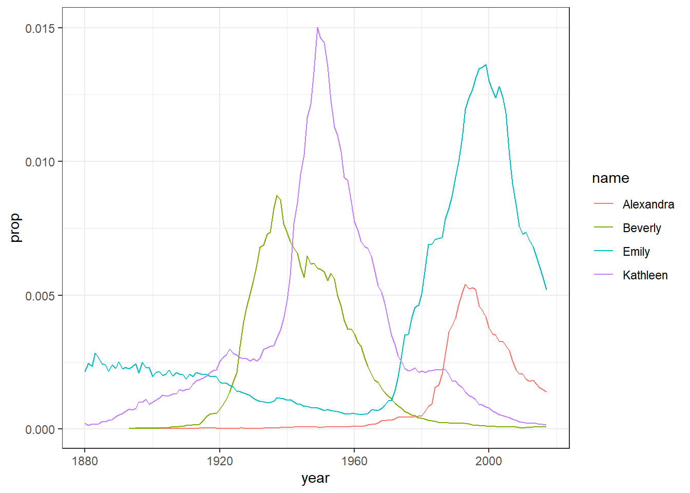

---
title: "03-lab03"
output:
  html_document:
    css: webex.css
    includes:
      after_body: webex.js
---


# 1A: Lab 3

<div class="info">
<p>In lab 2, you were introduced to the R environment (e.g. setting your working directory and the difference between .R and .Rmd files). You also began working with messy data by having a go at loading in datasets using <code>read_csv()</code>, joined files together using <code>inner_join()</code>, and pulled out variables of interest using <code>select()</code>.</p>
<p>In lab 3, we’ll be moving on to becoming familiar with the Wickham Six and the functionality of the R package, <code>tidyverse</code>!</p>
</div>

## Pre-class activities

Data comes in lots of different formats. One of the most common formats is that of a two-dimensional table (the two dimensions being rows and columns).  Usually, each row stands for a separate observation (e.g. a subject), and each column stands for a different variable (e.g. a response, category, or group). A key benefit of tabular data is that it allows you to store different types of data-numerical measurements, alphanumeric labels, categorical descriptors-all in one place.

It may surprise you to learn that scientists actually spend far more time cleaning and preparing their data than they spend actually analysing it. This means completing tasks such as cleaning up bad values, changing the structure of tables, merging information stored in separate tables, reducing the data down to a subset of observations, and producing data summaries. Some have estimated that up to 80% of time spent on data analysis involves such data preparation tasks (Dasu & Johnson, 2003)!

Many people seem to operate under the assumption that the only option for data cleaning is the painstaking and time-consuming cutting and pasting of data within a spreadsheet program like Excel. We have witnessed students and colleagues waste days, weeks, and even months manually transforming their data in Excel, cutting, copying, and pasting data. Fixing up your data by hand is not only a terrible use of your time, but it is error-prone and not reproducible. Additionally, in this age where we can easily collect massive datasets online, you will not be able to organise, clean, and prepare these by hand. 

In short, you will not thrive as a psychologist if you do not learn some key data wrangling skills. Although every dataset presents unique challenges, there are some systematic principles you should follow that will make your analyses easier, less error-prone, more efficient, and more reproducible.

In this lesson you will see how data science skills will allow you to efficiently get answers to nearly any question you might want to ask about your data. By learning how to properly make your computer do the hard and boring work for you, you can focus on the bigger issues.

### Tidyverse

Tidyverse (https://www.tidyverse.org/) is a collection of R packages created by world-famous data scientist Hadley Wickham. 

Tidyverse contains six core packages:  `dplyr`, `tidyr`, `readr`, `purrr`,  `ggplot2`, and `tibble`. Last week when you typed `library(tidyverse)` into R, you will have seen that it loads in all of these packages in one go. Within these six core packages, you should be able to find everything you need to wrangle and visualise your data. 

In this chapter, we are going to focus on the `dplyr` package, which contains six important functions: 

* `select()` Include or exclude certain variables (columns)
* `filter()` Include or exclude certain observations (rows)
* `mutate()` Create new variables (columns)
* `arrange()` Change the order of observations (rows)
* `group_by()` Organize the observations into groups
* `summarise()` Derive aggregate variables for groups of observations

These six functions are known as ’single table verbs’ because they only operate on one table at a time. Although the operations of these functions may seem very simplistic, it’s amazing what you can accomplish when you string them together: Hadley Wickham has claimed that 90% of data analysis can be reduced to the operations described by these six functions. 

Again, we don't expect you to remember everything in this pre-class - the important thing is that you know where to come and look for help when you need to do particular tasks. Being good at coding really is just being good at knowing what to copy and paste. 


### The `babynames` database

To demonstrate the power of the six `dplyr` verbs, we will use them to work with the babynames data from the `babynames` package. The babynames dataset has historical information about births of babies in the U.S.

### Activity 1: Set-up

Do the following. If you need help, consult the Lab 2 materials.

* Download the <a href="files/stub-3.1.zip" download>`lab 3 pre-class Markdown`</a>, extract the file and then move it in to your Data Skills folder.
* Open R Studio and ensure the environment is clear.  
* Open the `stub-3.1.Rmd` file and ensure that the working directory is set to your Data Skills folder and that the two .csv data files are in your working directory (you should see them in the file pane).    
* If you are working on your own computer, install the package `babynames`. Remember, **never install packages if you are working on a university computer**. The university computers will already have this package installed.  
* Type and run the code that loads the packages `tidyverse` and `babynames` using `library()` in the Activity 1 code chunk.  


```r
library(tidyverse)
library(babynames)
```


### Activity 2: Look at the data

The package `babynames` contains an object of the same name that contains all the data about babynames. 

* View a preview of this dataset by typing `babynames` in to the console. You should see the following output:


```r
babynames
```

```
## # A tibble: 1,924,665 x 5
##     year sex   name          n   prop
##    <dbl> <chr> <chr>     <int>  <dbl>
##  1  1880 F     Mary       7065 0.0724
##  2  1880 F     Anna       2604 0.0267
##  3  1880 F     Emma       2003 0.0205
##  4  1880 F     Elizabeth  1939 0.0199
##  5  1880 F     Minnie     1746 0.0179
##  6  1880 F     Margaret   1578 0.0162
##  7  1880 F     Ida        1472 0.0151
##  8  1880 F     Alice      1414 0.0145
##  9  1880 F     Bertha     1320 0.0135
## 10  1880 F     Sarah      1288 0.0132
## # ... with 1,924,655 more rows
```

The first line tells us that the object we are looking at is in a `tibble` with information on five variables with over 1.9 million rows. Yes, this dataset contains 1.8 **million** observations. Interested in analyzing these data by hand? No thanks! A tibble is basically a table of data presenting a two dimensional array of your data. 

Each row in the table represents data about births for a given name and sex in a given year. The variables are:


variable|type             |description
--------|-----------------|--------------------------------------------
  year  |double (numeric) |year of birth
  sex 	|character 	      |recorded sex of baby (F = female, M = male)
  name 	|character 	      |forename given to baby
  n 	  |integer 	        |number of babies given that name
  prop 	|double (numeric) |	proportion of all babies of that sex


The first row of the table tells us that in the year 1880, there were 7065 baby girls born in the U.S. who were given the name Mary, and this accounted for about 7% of all baby girls.

### Activity 3: Data visualisation

* Type the code below into a new code chunk and run it. 

We're going to cover how to write visualisation code in Lab so still don't worry about not understanding the plot code yet. The point is show you how much you can accomplish with very little code. The code creates a graph showing the popularity of four girl baby names - Alexandra, Beverly, Emily, and Kathleen - from 1880 to 2014.  You should see Figure \@ref(fig:babynames-plot) appear, which shows the proportion of each name across different years -  you can plug in different names if you like and see how the plot changes.


```r
dat <- babynames %>% 
  filter(name %in% c("Emily","Kathleen","Alexandra","Beverly"), sex=="F")

ggplot(data = dat,aes(x = year,y = prop, colour=name))+
  geom_line()  
```

<div class="figure" style="text-align: center">

<p class="caption">(\#fig:babynames-plot)Proportion of four baby names from 1880 to 2014</p>
</div>

### Activity 4: Selecting variables of interest

There are two numeric measurements of name popularity, `prop` (the proportion of all babies with each name) is probably more useful than `n`  (total number of babies with that name), because it takes into account that different numbers of babies are born in different years. 

Just like in Lab 2, if we wanted to create a dataset that only includes certain variables, we can use the `select()` function from the `dplyr` package. Run the below code to only select the columns `year`, `sex`, `name` and `prop`.  


```r
select(.data = babynames, # the object you want to select variables from
       year, sex, name, prop) # the variables you want to select
```

```
## # A tibble: 1,924,665 x 4
##     year sex   name        prop
##    <dbl> <chr> <chr>      <dbl>
##  1  1880 F     Mary      0.0724
##  2  1880 F     Anna      0.0267
##  3  1880 F     Emma      0.0205
##  4  1880 F     Elizabeth 0.0199
##  5  1880 F     Minnie    0.0179
##  6  1880 F     Margaret  0.0162
##  7  1880 F     Ida       0.0151
##  8  1880 F     Alice     0.0145
##  9  1880 F     Bertha    0.0135
## 10  1880 F     Sarah     0.0132
## # ... with 1,924,655 more rows
```

Alternatively, you can also tell R which variables you don't want, in this case, rather than telling R to select `year`, `sex`, `name` and `prop`, we can simply tell it to drop the column `n` using the minus sign `-` before the variable name.


```r
select(.data = babynames, -n)
```

```
## # A tibble: 1,924,665 x 4
##     year sex   name        prop
##    <dbl> <chr> <chr>      <dbl>
##  1  1880 F     Mary      0.0724
##  2  1880 F     Anna      0.0267
##  3  1880 F     Emma      0.0205
##  4  1880 F     Elizabeth 0.0199
##  5  1880 F     Minnie    0.0179
##  6  1880 F     Margaret  0.0162
##  7  1880 F     Ida       0.0151
##  8  1880 F     Alice     0.0145
##  9  1880 F     Bertha    0.0135
## 10  1880 F     Sarah     0.0132
## # ... with 1,924,655 more rows
```


Note that `select()` does not change the original tibble, but makes a new tibble with the specified columns. If you don't save this new tibble to an object, it won't be saved. If you want to keep this new dataset, create a new object. When you run this code, you will see your new tibble appear in the environment pane. 


```r
new_dat <- select(.data = babynames, -n)
```

### Activity 5: Arranging the data

The function `arrange()` will sort the rows in the table according to the columns you supply. Try running the following code:


```r
arrange(.data = babynames, # the data you want to sort
        name) # the variable you want to sort by
```

```
## # A tibble: 1,924,665 x 5
##     year sex   name      n       prop
##    <dbl> <chr> <chr> <int>      <dbl>
##  1  2007 M     Aaban     5 0.00000226
##  2  2009 M     Aaban     6 0.00000283
##  3  2010 M     Aaban     9 0.00000439
##  4  2011 M     Aaban    11 0.00000542
##  5  2012 M     Aaban    11 0.00000543
##  6  2013 M     Aaban    14 0.00000694
##  7  2014 M     Aaban    16 0.00000783
##  8  2015 M     Aaban    15 0.00000736
##  9  2016 M     Aaban     9 0.00000446
## 10  2017 M     Aaban    11 0.0000056 
## # ... with 1,924,655 more rows
```


The data are now sorted in ascending alphabetical order by name. The default is to sort in ascending order. If you want it descending, wrap the name of the variable in the `desc()` function. For instance, to sort by year in descending order, run the following code:


```r
arrange(babynames,desc(year)) 
```

```
## # A tibble: 1,924,665 x 5
##     year sex   name          n    prop
##    <dbl> <chr> <chr>     <int>   <dbl>
##  1  2017 F     Emma      19738 0.0105 
##  2  2017 F     Olivia    18632 0.00994
##  3  2017 F     Ava       15902 0.00848
##  4  2017 F     Isabella  15100 0.00805
##  5  2017 F     Sophia    14831 0.00791
##  6  2017 F     Mia       13437 0.00717
##  7  2017 F     Charlotte 12893 0.00688
##  8  2017 F     Amelia    11800 0.00629
##  9  2017 F     Evelyn    10675 0.00569
## 10  2017 F     Abigail   10551 0.00563
## # ... with 1,924,655 more rows
```

You can also sort by more than one column. What do you think the following code will do?


```r
arrange(babynames, desc(year), desc(sex), desc(prop)) 
```

### Activity 6: Using filter to select observations

We have previously used `select()` to select certain variables or columns, however, frequently you will also want to select only certain observations or rows, for example, only babies born after 1999, or only babies named "Mary". You do this using the verb `filter()`. The `filter()` function is a bit more involved than the other verbs, and requires more detailed explanation, but this is because it is also extremely powerful. 

Here is an example of filter, can you guess what it will do?


```r
 filter(.data = babynames, year > 2000)
```

The first part of the code tells the function to use the object `babynames`. The second argument, `year > 2000`, is what is known as a **Boolean expression**: an expression whose evaluation results in a value of TRUE or FALSE. What `filter()` does is include any observations (rows) for which the expression evaluates to TRUE, and exclude any for which it evaluates to FALSE. So in effect, behind the scenes, `filter()` goes through the entire set of 1.8 million observations, row by row, checking the value of year for each row, keeping it if the value is greater than 2000, and rejecting it if it is less than 2000. To see how a boolean expression works, consider the code below:


```r
years <- 1996:2005
years
years > 2000
```

```
##  [1] 1996 1997 1998 1999 2000 2001 2002 2003 2004 2005
##  [1] FALSE FALSE FALSE FALSE FALSE  TRUE  TRUE  TRUE  TRUE  TRUE
```

You can see that the expression `years > 2000` returns a **logical vector** (a vector of TRUE and FALSE values), where each element represents whether the expression is true or false for that element. For the first five elements (1996 to 2000) it is false, and for the last five elements (2001 to 2005) it is true.

Here are the most commonly used Boolean expressions.

Operator	|Name	                 |is TRUE if and only if
----------|----------------------|---------------------------------
A < B 	  |less than 	           |A is less than B
A <= B 	  |less than or equal    |A is less than or equal to B
A > B 	  |greater than 	       |A is greater than B
A >= B 	  |greater than or equal |A is greater than or equal to B
A == B 	  |equivalence 	         |A exactly equals B
A != B 	  |not equal 	           |A does not exactly equal B
A %in% B 	|in 	                 |A is an element of vector B

If you want only those observations for a specific name (e.g., Mary), you use the equivalence operator `==`. Note that you use double equal signs, not a single equal sign.


```r
filter(babynames, name == "Mary")
```

```
## # A tibble: 268 x 5
##     year sex   name      n     prop
##    <dbl> <chr> <chr> <int>    <dbl>
##  1  1880 F     Mary   7065 0.0724  
##  2  1880 M     Mary     27 0.000228
##  3  1881 F     Mary   6919 0.0700  
##  4  1881 M     Mary     29 0.000268
##  5  1882 F     Mary   8148 0.0704  
##  6  1882 M     Mary     30 0.000246
##  7  1883 F     Mary   8012 0.0667  
##  8  1883 M     Mary     32 0.000284
##  9  1884 F     Mary   9217 0.0670  
## 10  1884 M     Mary     36 0.000293
## # ... with 258 more rows
```

If you wanted all the names except Mary, you use the 'not equals' operator:


```r
filter(babynames, name!="Mary") 
```

```
## # A tibble: 1,924,397 x 5
##     year sex   name          n   prop
##    <dbl> <chr> <chr>     <int>  <dbl>
##  1  1880 F     Anna       2604 0.0267
##  2  1880 F     Emma       2003 0.0205
##  3  1880 F     Elizabeth  1939 0.0199
##  4  1880 F     Minnie     1746 0.0179
##  5  1880 F     Margaret   1578 0.0162
##  6  1880 F     Ida        1472 0.0151
##  7  1880 F     Alice      1414 0.0145
##  8  1880 F     Bertha     1320 0.0135
##  9  1880 F     Sarah      1288 0.0132
## 10  1880 F     Annie      1258 0.0129
## # ... with 1,924,387 more rows
```

And if you wanted names from a defined set - e.g., names of British queens - you can use `%in%`:


```r
filter(babynames, name %in% c("Mary","Elizabeth","Victoria"))
```

```
## # A tibble: 772 x 5
##     year sex   name          n      prop
##    <dbl> <chr> <chr>     <int>     <dbl>
##  1  1880 F     Mary       7065 0.0724   
##  2  1880 F     Elizabeth  1939 0.0199   
##  3  1880 F     Victoria     93 0.000953 
##  4  1880 M     Mary         27 0.000228 
##  5  1880 M     Elizabeth     9 0.0000760
##  6  1881 F     Mary       6919 0.0700   
##  7  1881 F     Elizabeth  1852 0.0187   
##  8  1881 F     Victoria    117 0.00118  
##  9  1881 M     Mary         29 0.000268 
## 10  1882 F     Mary       8148 0.0704   
## # ... with 762 more rows
```


This gives you data for the names in the vector on the right hand side of `%in%`. You can always invert an expression to get its opposite. So, for instance, if you instead wanted to get rid of all Marys, Elizabeths, and Victorias you would use the following:


```r
filter(babynames, !(name %in% c("Mary","Elizabeth","Victoria")))
```

```
## # A tibble: 1,923,893 x 5
##     year sex   name         n   prop
##    <dbl> <chr> <chr>    <int>  <dbl>
##  1  1880 F     Anna      2604 0.0267
##  2  1880 F     Emma      2003 0.0205
##  3  1880 F     Minnie    1746 0.0179
##  4  1880 F     Margaret  1578 0.0162
##  5  1880 F     Ida       1472 0.0151
##  6  1880 F     Alice     1414 0.0145
##  7  1880 F     Bertha    1320 0.0135
##  8  1880 F     Sarah     1288 0.0132
##  9  1880 F     Annie     1258 0.0129
## 10  1880 F     Clara     1226 0.0126
## # ... with 1,923,883 more rows
```

You can include as many expressions as you like as additional arguments to `filter()` and it will only pull out the rows for which all of the expressions for that row evaluate to TRUE. For instance, `filter(babynames, year > 2000, prop > .01)` will pull out only those observations beyond the year 2000 that represent greater than 1% of the names for a given sex; any observation where either expression is false will be excluded. This ability to string together criteria makes `filter()` a very powerful member of the Wickham Six.

**Remember that this section exists. It will contain a lot of the answers to problems you face when wrangling data!**

### Activity 7: Creating new variables

Sometimes we need to create a new variable that doesn’t exist in our dataset. For instance, we might want to figure out what decade a particular year belongs to. To create new variables, we use the function `mutate()`. Note that if you want to save this new column, you need to save it to an object. Here, you are mutating a new column and attaching it to the `new_dat` object you created in Activity 4.


```r
new_dat <- mutate(.data = babynames, # the tibble you want to add a colum to
                  decade = floor(year/10) *10) # new column name = what you want it to contain
new_dat
```

```
## # A tibble: 1,924,665 x 6
##     year sex   name          n   prop decade
##    <dbl> <chr> <chr>     <int>  <dbl>  <dbl>
##  1  1880 F     Mary       7065 0.0724   1880
##  2  1880 F     Anna       2604 0.0267   1880
##  3  1880 F     Emma       2003 0.0205   1880
##  4  1880 F     Elizabeth  1939 0.0199   1880
##  5  1880 F     Minnie     1746 0.0179   1880
##  6  1880 F     Margaret   1578 0.0162   1880
##  7  1880 F     Ida        1472 0.0151   1880
##  8  1880 F     Alice      1414 0.0145   1880
##  9  1880 F     Bertha     1320 0.0135   1880
## 10  1880 F     Sarah      1288 0.0132   1880
## # ... with 1,924,655 more rows
```

In this case, you are creating a new column decade  which has the decade each year appears in. This is calculated using the command `decade = floor(year/10)*10`.

### Activity 8: Grouping and summarising

Most quantitative analyses will require you to summarise your data somehow, for example, by calculating the mean, median or a sum total of your data. You can perform all of these operations using the function `summarise()`.

First, let's use the object `dat` that just has the data for the four girls names, Alexandra, Beverly, Emily, and Kathleen. To start off, we're simply going to calculate the total number of babies across all years that were given one of these four names.

It's useful to get in the habit of translating your code into full sentences to make it easier to figure out what's happening. You can read the below code as "run the function summarise using the data in the object `dat` to create a new variable named `total` that is the result of adding up all the numbers in the column `n`".


```r
summarise(.data = dat, # the data you want to use
          total = sum(n)) # result = operation
```

```
## # A tibble: 1 x 1
##     total
##     <int>
## 1 2161374
```

`summarise()` becomes even more powerful when combined with the final `dplyr` function, `group_by()`. Quite often, you will want to produce your summary statistics broken down by groups, for examples, the scores of participants in different conditions, or the reading time for native and non-native speakers.

There are two ways you can use `group_by()`. First, you can create a new, grouped object.


```r
group_dat <- group_by(.data = dat, # the data you want to group
                      name) # the variable you want to group by
```

If you look at this object in the viewer, it won't look any different to the original `dat`, however, the underlying structure has changed. Let's run the above summarise code again, but now using the grouped data.


```r
summarise(.data = group_dat, 
          total = sum(n)) 
```

```
## # A tibble: 4 x 2
##   name       total
##   <chr>      <int>
## 1 Alexandra 231364
## 2 Beverly   376914
## 3 Emily     841491
## 4 Kathleen  711605
```

`summarise()` has performed exactly the same operation as before - adding up the total number in the column `n` - but this time it has done is separately for each group, which in this case was the variable `name`.

You can request multiple summary calculations to be performed in the same function. For example, the following code calculates the mean and median number of babies given each name every year.


```r
summarise(group_dat,
          mean_year = mean(n),
          median_year = median(n))
```

```
## # A tibble: 4 x 3
##   name      mean_year median_year
##   <chr>         <dbl>       <dbl>
## 1 Alexandra     1977.        192 
## 2 Beverly       3089.        710.
## 3 Emily         6098.       1392.
## 4 Kathleen      5157.       3098
```

You can also add multiple grouping variables. For example, the following code groups `new_dat` by `sex` and `decade` and then calculates the summary statistics to give us the mean and median number of male and female babies in each decade.


```r
group_new_dat <- group_by(new_dat, sex, decade)
summarise(group_new_dat,
          mean_year = mean(n),
          median_year = median(n))
```

```
## # A tibble: 28 x 4
## # Groups:   sex [2]
##    sex   decade mean_year median_year
##    <chr>  <dbl>     <dbl>       <dbl>
##  1 F       1880      111.          13
##  2 F       1890      128.          13
##  3 F       1900      131.          12
##  4 F       1910      187.          12
##  5 F       1920      211.          12
##  6 F       1930      214.          12
##  7 F       1940      262.          12
##  8 F       1950      288.          13
##  9 F       1960      235.          12
## 10 F       1970      147.          11
## # ... with 18 more rows
```

### Activity 9: Pipes

The final activity for this chapter essentially repeats what we've already covered but in a slightly different way. In the previous activities, you created new objects with new variables or groupings and then you called `summarise()` on those new objects in separate lines of code. As a result, you had multiple objects in your environment pane and you need to make sure that you keep track of the different names. 

Instead, you can use **pipes**. Pipes are written as `%>%`and they should be read as "and then". Pipes allow you to string together 'sentences' of code into 'paragraphs' so that you don't need to create intermediary objects. Again, it is easier to show than tell.

The below code does **exactly** the same as all the code we wrote above but it only creates one object.


```r
pipe_summary <- mutate(babynames, decade = floor(year/10) *10) %>%
  filter(name %in% c("Emily","Kathleen","Alexandra","Beverly"), sex=="F") %>%
  group_by(name, decade) %>%
  summarise(mean_decade = mean(n))
```


The reason that this function is called a pipe is because it 'pipes' the data through to the next function. When you wrote the code previously, the first argument of each function was the dataset you wanted to work on. When you use pipes it will automatically take the data from the previous line of code so you don't need to specify it again.

<div class="try">
<p>When learning to code it can be a useful practice to read your code ‘out loud’ in full sentences to help you understand what it is doing. You can read the code above as “create a new variable called decade AND THEN only keep the names Emily, Kathleen, Alexandra and Beverly that belong to female babies AND THEN group the dataset by name and decade AND THEN calculate the mean number of babies with each name per decade.” Try doing this each time you write a new bit of code.</p>
</div>

Some people find pipes a bit tricky to understand from a conceptual point of view, however, it's well worth learning to use them as when your code starts getting longer they are much more efficient and mean you have to write less code which is always a good thing! 

#### Finished!

That was a long pre-class but remember, you don't need to memorise all of this code. You just need to know where to look for help. 

## In-class activities

### Activity 1: Set-up

Do the following. If you need help, consult the Lab 2 materials.

* Download the <a href="files/stub-3.2.zip" download>`lab 3 in-class Markdown`</a>, extract the file and then move it in to your Data Skills folder.
* Open R Studio and ensure the environment is clear.  
* Open the `stub-3.2.Rmd` file and ensure that the working directory is set to your Data Skills folder and that the two .csv data files are in your working directory (you should see them in the file pane).   
* Type and run the below code to load the `tidyverse` package and to load in the data files. 


```r
library(tidyverse) 

dat <- read_csv('ahi-cesd.csv')
pinfo <- read_csv('participant-info.csv')
all_dat <- inner_join(dat, pinfo, by= c("id", "intervention"))
```


Now let's start working with our `tidyverse` verb functions...

### Activity 2: Select  

Select the columns all_dat, ahiTotal, cesdTotal, sex, age, educ, income, occasion, elapsed.days from the data and create a variable called ```summarydata```. 


```r
summarydata <- select(all_dat, ahiTotal, cesdTotal, sex, age, educ, income, occasion, elapsed.days)
```

******

**Pause here and interpret the above code and output**

* Discuss in pairs or groups how you would translate this code into English 
* What columns have been removed from the data? 

******

### Activity 3: Arrange  

Arrange the data in the variable created above (```summarydata```) by ahiTotal with lowest score first. 

```r
ahi_asc <- arrange(summarydata, by = ahiTotal)
```

******

* How could you arrange this data in **descending** order (highest score first)?  


<div class='solution'><button>Solution</button>


```r
arrange(summarydata, by = desc(ahiTotal))
```

</div>


* What is the smallest ahiTotal score? <input class='solveme nospaces' size='2' data-answer='["32"]'/>

* What is the largest ahiTotal score? <input class='solveme nospaces' size='3' data-answer='["114"]'/>

******

### Activity 4: Filter  

Filter the data ```ahi_asc``` by taking out those who are over 65 years of age.  

```r
age_65max <- filter(ahi_asc, age < 65)
```

******

* What does `filter()` do? 

<select class='solveme' data-answer='["removes information that we are not interested in"]'> <option></option> <option>splits a column into multiple columns</option> <option>transforms existing columns</option> <option>takes multiple columns and collapses them together</option> <option>removes information that we are not interested in</option></select>

* How many observations are left in `age_65max` after running `filter()`? <input class='solveme nospaces' size='3' data-answer='["939"]'/>

******

### Activity 5: Summarise  

Then, use summarise to create a new variable ```data_median```, which calculates the median ahiTotal score in this grouped data and assign it a table head called ```median_score```.

```r
data_median <- summarise(age_65max, median_score = median(ahiTotal))
```

******

* What is the median score? <input class='solveme nospaces' size='2' data-answer='["74"]'/>

* Change the above code to give you the **mean score**. What is the mean score to 2 decimal places? <input class='solveme nospaces' size='5' data-answer='["72.48"]'/>


<div class='solution'><button>Solution</button>


```r
summarise(age_65max, mean_score = mean(ahiTotal))
```

</div>


******

### Activity 6: Group_by  

Use mutate to create a new column called `Happiness_Category` in `age_65max` which categorises participants based on whether they score above the median `ahiTotal` score for all participants. 

Then, group the data stored in  ```age_65max``` by `Happiness_Category`, and store it in an object named ```happy_dat```. 

Finally, use summarise to calculate the median `cesdTotal` score for participants who scored above and below the median `ahiTotal` score and save it in a new object named `data_median_group`.


```r
age_65max <- mutate(age_65max, Happiness_Category = (ahiTotal > 74))
happy_dat <- group_by(age_65max, Happiness_Category)

data_median_group <- summarise(happy_dat, median_score = median(cesdTotal))
```

******

**Pause here and interpret the above code and output**

* What does `group_by()` do? 

<select class='solveme' data-answer='["groups data frames based on a specific column so that all later operations are carried out on a group basis"]'> <option></option> <option>provides summary statistics of an existing dataframe</option> <option>organises information in ascending or descending order</option> <option>transforms existing columns</option> <option>groups data frames based on a specific column so that all later operations are carried out on a group basis</option></select>

* How would you change the code to group by education rather than `Happiness_Category`?


<div class='solution'><button>Solution</button>


```r
group_by(age_65max, educ)
```

</div>


******

### Activity 7: Data visualisation

Copy, paste and run the below code into a new code chunk to create a plot of depression scores grouped by income level using the `age_65max` data.


```r
ggplot(age_65max, aes(x = as.factor(income), y = cesdTotal, fill = as.factor(income))) +
  geom_violin(trim = FALSE, show.legend = FALSE, alpha = .6) +
  geom_boxplot(width = .2, show.legend = FALSE, alpha = .5) +
  scale_fill_viridis_d(option = "D") +
  scale_x_discrete(name = "Income Level", labels = c("Below Average", "Average", "Above Average")) +
  scale_y_continuous(name = "Depression Score")
```

* Which income group has the highest median depression scores? <select class='solveme' data-answer='["Below Average"]'> <option></option> <option>Below Average</option> <option>Average</option> <option>Above Average</option></select>

* Which group has the highest density of scores at any one point? <select class='solveme' data-answer='["Above Average"]'> <option></option> <option>Below Average</option> <option>Average</option> <option>Above Average</option></select>


<div class='solution'><button>Explain This Answer</button>

Density is represented by the curvy line around the boxplot that looks a little bit like a (drunk) violin. The fatter the violin, the more data points there are at any one point. This means that in the above plot, the Above Average group has the highest density because this has the widest violin, i.e., there are lots of people in the Above Average income group with a score of about 5.

</div>


* Is income group a between-subject or within-subject variable? <select class='solveme' data-answer='["Between-subjects"]'> <option></option> <option>Between-subjects</option> <option>Within-subjects</option></select>


<div class='solution'><button>Explain This Answer</button>

Between-subjects designs are where different participants are in different groups. Within-subject designs are when the same participants are in all groups. Income is an example of a between-subject variable because participants can only be in one grouping level of the independent variable

</div>


## Activity 8: Make R your own

Finally, you can customise how R Studio looks to make it feel more like your own personal version. Click `Tools` - `Global Options` - `Apperance`. You can change the default font, font size, and general apperance of R Studio, including using dark mode. Play around with the settings and see which one you prefer - you're going to spend a lot of time with R, it might as well look nice!


#### Finished!

Well done! As a final step, try knitting the file to HTML. Remember to save your Markdown in your Lab 3 folder and make a note of any mistakes you made and how you fixed them. 

## Homework

You can download all the R homework files and Assessment Information you need from the Lab Homework section of the [Psych 1A Moodle](https://moodle.gla.ac.uk/course/view.php?id=16358). 

You should also begin to write your essay. 
