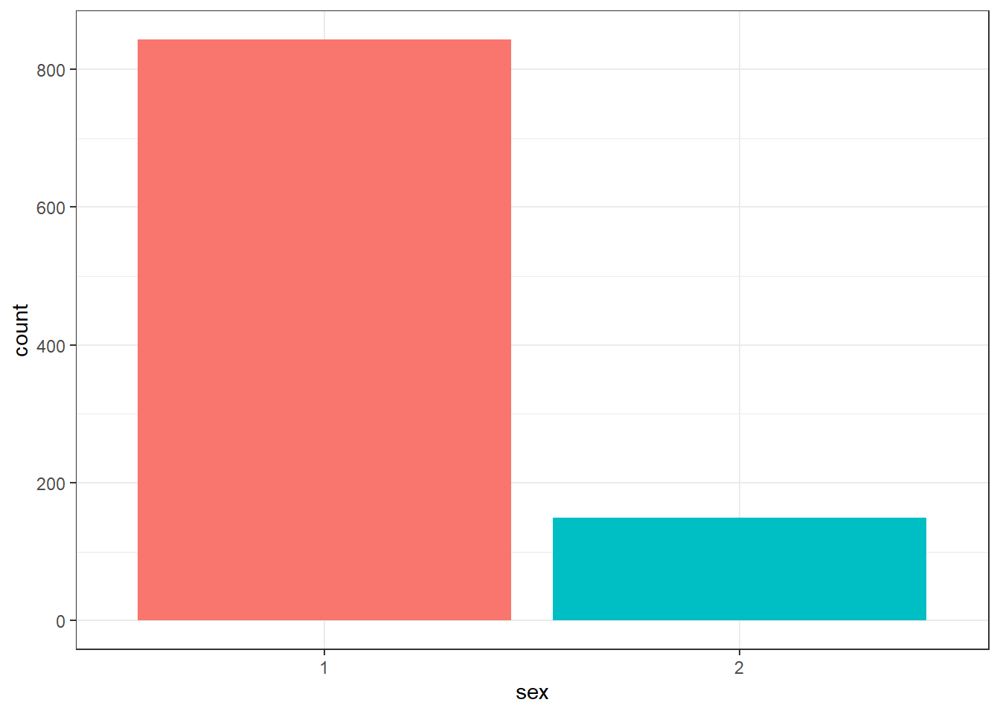
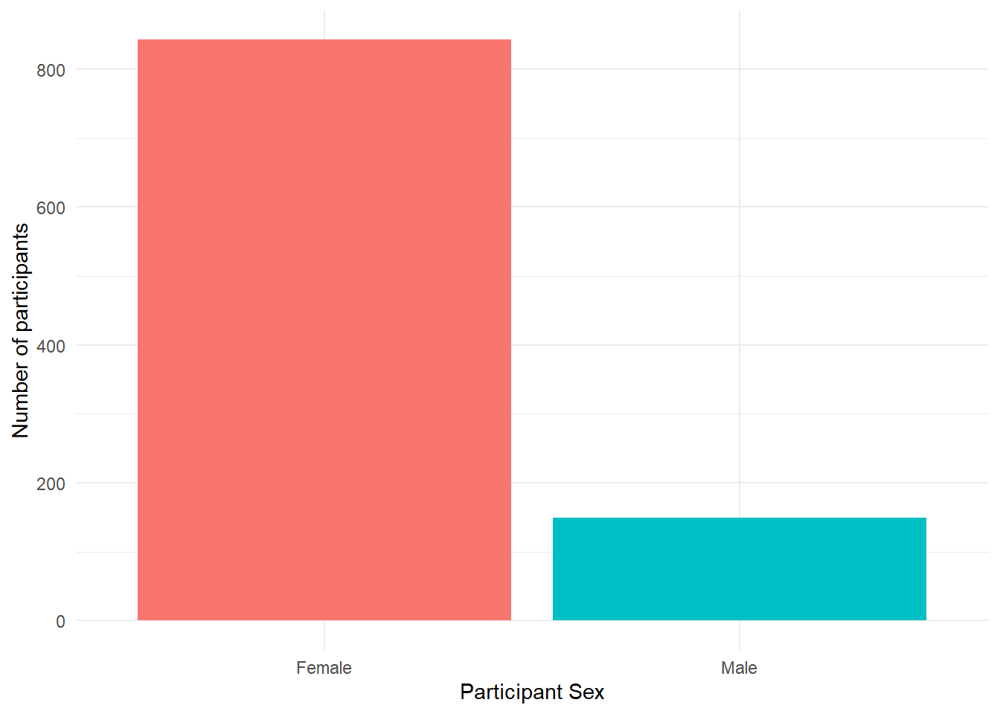
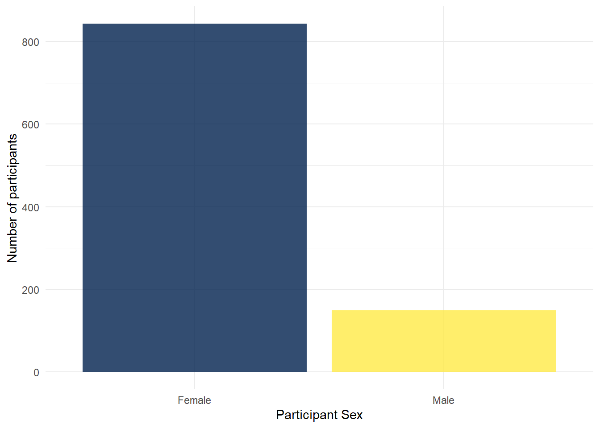
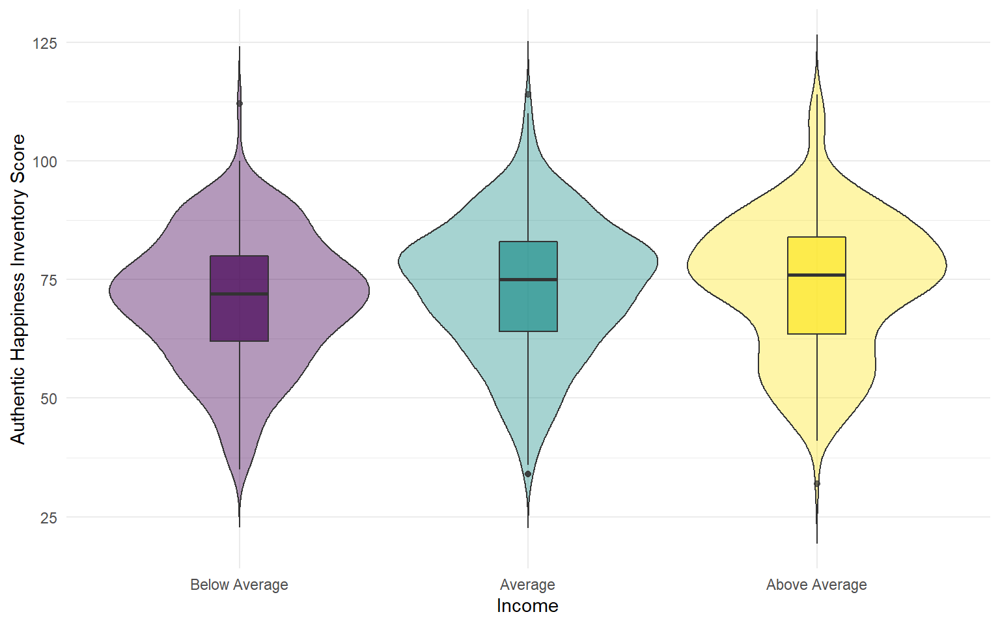

# 1A: Lab 4

## Pre-class activities

### Activity 1: dplyr recap

In [Lab 3](lab-3.html) we were introduced to the tidyverse package, `dplyr`, and its six important functions. As a recap, which function(s) would you use to approach each of the following problems?

* We have a dataset of 400 adults, but we want to remove anyone with an age of 50 years or more. To do this, we could use the <select class='solveme' data-answer='["filter()"]'> <option></option> <option>filter()</option> <option>summarise()</option> <option>mutate()</option> <option>select()</option> <option>arrange()</option> <option>group_by()</option></select> function.

* We are interested in overall summary statistics for our data, such as the overall average and total number of observations. To do this, we could use the <select class='solveme' data-answer='["summarise()"]'> <option></option> <option>arrange()</option> <option>mutate()</option> <option>filter()</option> <option>select()</option> <option>summarise()</option> <option>group_by()</option></select> function.

* Our dataset has a column with the number of cats a person has, and a column with the number of dogs. We want to calculate a new column which contains the total number of pets each participant has. To do this, we could use the <select class='solveme' data-answer='["mutate()"]'> <option></option> <option>select()</option> <option>filter()</option> <option>summarise()</option> <option>mutate()</option> <option>arrange()</option> <option>group_by()</option></select> function.

* We want to calculate the average for each participant in our dataset. To do this we could use the <select class='solveme' data-answer='["group_by() and summarise()"]'> <option></option> <option>group_by() and summarise()</option> <option>arrange() and mutate()</option> <option>group_by() and arrange()</option> <option>filter() and select()</option></select> functions.

* We want to order a dataframe of participants by the number of cats that they own, but want our new dataframe to only contain some of our columns. To do this we could use the <select class='solveme' data-answer='["arrange() and select()","mutate() and filter()"]'> <option></option> <option>group_by() and mutate()</option> <option>select() and summarise()</option> <option>arrange() and select()</option> <option>mutate() and filter()</option></select> functions.

### Data visualisation

As Grolemund and Wickham tell us:

> Visualisation is a fundamentally human activity. A good visualisation will show you things that you did not expect, or raise new questions about the data. A good visualisation might also hint that you’re asking the wrong question, or you need to collect different data. Visualisations can surprise you, but don’t scale particularly well because they require a human to interpret them.

(http://r4ds.had.co.nz/introduction.html)

Being able to visualise our variables, and relationships between our variables, is a very useful skill. Before we do any statistical analyses or present any summary statistics, we should visualising our data as it is:

1. A quick and easy way to check our data make sense, and to identify any unusual trends.

2. A way to honestly present the features of our data to anyone who reads our research.

`ggplot()` builds plots by combining layers (see Figure \@ref(fig:img-layers))). If you're used to making plots in Excel this might seem a bit odd at first, however, it means that you can customise each layer and R is capable of making very complex and beautiful figures ([this website](https://www.data-to-viz.com/) gives you a good sense of what's possible).

<div class="figure" style="text-align: center">

<p class="caption">(\#fig:img-layers)ggplot2 layers from Field et al. (2012)</p>
</div>

### Activity 2: Set-up

We're going to use the data from the Labs to explain how `ggplot2` works so let's do the set-up as usual. 

* Open R Studio and ensure the environment is clear.  
* Download the <a href="files/stub-4.1.zip" download>`lab 4 pre-class Markdown file`</a>, extract the file and then move it in to your Data Skills folder.
* Open the `stub-4.1.Rmd` file and ensure that the working directory is set to your Data Skills folder and that the two .csv data files are in your working directory (you should see them in the file pane).  
* Type and run the below code to load the `tidyverse` package and to load in the data files in to the Activity 2 code chunk. 


```r
library(tidyverse) 

dat <- read_csv('ahi-cesd.csv')
pinfo <- read_csv('participant-info.csv')
all_dat <- inner_join(dat, pinfo, by= c("id", "intervention"))
summarydata <- select(.data = all_dat, 
                      ahiTotal, cesdTotal, sex, age, 
                      educ, income, occasion, elapsed.days) 
```


### Activity 3: Factors

Before we go any further we need to perform an additional step of data processing that we have glossed over up until this point. First, run the below code to look at the structure of the dataset:


```r
str(summarydata)
```

```
## Classes 'spec_tbl_df', 'tbl_df', 'tbl' and 'data.frame':	992 obs. of  8 variables:
##  $ ahiTotal    : num  32 34 34 35 36 37 38 38 38 38 ...
##  $ cesdTotal   : num  50 49 47 41 36 35 50 55 47 39 ...
##  $ sex         : num  1 1 1 1 1 1 2 1 2 2 ...
##  $ age         : num  46 37 37 19 40 49 42 57 41 41 ...
##  $ educ        : num  4 3 3 2 5 4 4 4 4 4 ...
##  $ income      : num  3 2 2 1 2 1 1 2 1 1 ...
##  $ occasion    : num  5 2 3 0 5 0 2 2 2 4 ...
##  $ elapsed.days: num  182 14.2 33 0 202.1 ...
```

R assumes that all of the variables are numeric (represented by `num`) and this is going to be a problem because whilst `sex`, `educ`, and `income` are represented by numerical codes, they aren't actually numbers, they're categories, or **factors**. 

We need to tell R that these variables are factors and we can use `mutate()` to do this by overriding the original variable with the same data but classified as a factor. Type and run the below code to change the categories to factors.


```r
summarydata <- summarydata %>%
  mutate(sex = as.factor(sex),
         educ = as.factor(educ),
         income = as.factor(income))
```

You can read this code as "overwrite the data that is in the column sex with sex as a factor".

**Remember this. It's a really important step and if your graphs are looking weird this might be the reason.**

### Activity 4: Bar plot

For our first example we will recreate the bar plot showing the number of male and female participants from Lab 2 by showing you how the layers of code build up (next semester we have data that includes non-binary participants).

* The first line (or layer) sets up the base of the graph: the data to use and the aesthetics (what will go on the x and y axis, how the plot will be grouped).    
* `aes()` can take both an `x` and `y` argument, however, with a bar plot you are just asking R to count the number of data points in each group so you don't need to specify this. 


```r
ggplot(summarydata, aes(x = sex))
```

<div class="figure" style="text-align: center">

<p class="caption">(\#fig:layer1)First ggplot layer sets the axes</p>
</div>

* The next layer adds a **geom** or a shape, in this case we use `geom_bar()` as we want to draw a bar plot.  


```r
ggplot(summarydata, aes(x = sex)) +
  geom_bar()
```

<div class="figure" style="text-align: center">

<p class="caption">(\#fig:unnamed-chunk-3)Basic barplot</p>
</div>

* Adding `fill` to the first layer will separate the data into each level of the grouping variable and give it a different colour. In this case, there is a different coloured bar for each level of `sex`.


```r
ggplot(summarydata, aes(x = sex, fill = sex)) +
  geom_bar()
```

<div class="figure" style="text-align: center">

<p class="caption">(\#fig:unnamed-chunk-4)Barplot with colour</p>
</div>

* `fill()` has also produced a plot legend to the right of the graph. When you have multiple grouping variables you need this to know which groups each bit of the plot is referring to, but in this case it is redundant because it doesn't tell us anything that the axis labels don't already. We can get rid of it by adding `show.legend = FALSE` to the `geom_bar()` code.


```r
ggplot(summarydata, aes(x = sex, fill = sex)) +
  geom_bar(show.legend = FALSE)
```

<div class="figure" style="text-align: center">

<p class="caption">(\#fig:unnamed-chunk-5)Barplot without legend</p>
</div>

We might want to tidy up our plot to make it look a bit nicer. First we can edit the axis labels to be more informative. The most common functions you will use are:

* `scale_x_continuous()` for adjusting the x-axis for a continuous variable
* `scale_y_continuous()` for adjusting the y-axis for a continuous variable
* `scale_x_discrete()` for adjusting the x-axis for a discrete/categorical variable
* `scale_y_discrete()` for adjusting the y-axis for a discrete/categorical variable

And in those functions the two most common arguments you will use are:

* `name` which controls the name of each axis
* `labels` which controls the names of the break points on the axis

There are lots more ways you can customise your axes but we'll stick with these for now. Copy, paste, and run the below code to change the axis labels and change the numeric sex codes into words.


```r
ggplot(summarydata, aes(x = sex, fill = sex)) +
  geom_bar(show.legend = FALSE) +
  scale_x_discrete(name = "Participant Sex", 
                   labels = c("Female", "Male")) +
  scale_y_continuous(name = "Number of participants")
```

<div class="figure" style="text-align: center">

<p class="caption">(\#fig:unnamed-chunk-6)Barplot with axis labels</p>
</div>

Second, you might want to adjust the colours and the visual style of the plot. `ggplot2` comes with built in themes. Below, we'll use `theme_minimal()` but try typing `theme_` into a code chunk and try all the options that come up to see which one you like best. 


```r
ggplot(summarydata, aes(x = sex, fill = sex)) +
  geom_bar(show.legend = FALSE) +
  scale_x_discrete(name = "Participant Sex", 
                   labels = c("Female", "Male")) +
  scale_y_continuous(name = "Number of participants") +
  theme_minimal()
```

<div class="figure" style="text-align: center">

<p class="caption">(\#fig:unnamed-chunk-7)Barplot with minimal theme</p>
</div>

There are various options to adjust the colours but a good way to be inclusive is to use a colour-blind friendly palette that can also be read if printed in black-and-white. To do this, we can add on the function `scale_fill_viridis_d()`. This function has 5 colour options, A, B, C, D, and E. I prefer E but you can play around with them and choose the one you prefer.


```r
ggplot(summarydata, aes(x = sex, fill = sex)) +
  geom_bar(show.legend = FALSE) +
  scale_x_discrete(name = "Participant Sex", 
                   labels = c("Female", "Male")) +
  scale_y_continuous(name = "Number of participants") +
  theme_minimal() +
  scale_fill_viridis_d(option = "E")
```

<div class="figure" style="text-align: center">

<p class="caption">(\#fig:unnamed-chunk-8)Barplot with colour-blind friendly colour scheme</p>
</div>

Finally, you can also adjust the transparency of the bars by adding `alpha` to `geom_bar()`. Play around with the value and see what value you prefer.


```r
ggplot(summarydata, aes(x = sex, fill = sex)) +
  geom_bar(show.legend = FALSE, alpha = .8) +
  scale_x_discrete(name = "Participant Sex", 
                   labels = c("Female", "Male")) +
  scale_y_continuous(name = "Number of participants") +
  theme_minimal() +
  scale_fill_viridis_d(option = "E")
```

<div class="figure" style="text-align: center">

<p class="caption">(\#fig:unnamed-chunk-9)Barplot with adjusted alpha</p>
</div>


<div class="warning">
<p>In R terms, <code>ggplot2</code> is a fairly old package. As a result, the use of pipes wasn’t included when it was originally written. As you can see in the code above, the layers of the code are separated by <code>+</code> rather than <code>%&gt;%</code>. In this case, <code>+</code> is doing essentially the same job as a pipe - be careful not to confuse them.</p>
</div>

### Activity 5: Violin-boxplot

As our final activity we will also explain the code used to create the violin-boxplot from Lab 2, hopefully now you will be able to see how similar it is in structure to the bar chart code. In fact, there are only three differences:

1. We have added a `y` argument to the first layer because we wanted to represent two variables, not just a count.
2. `geom_violin()` has an additional argument `trim`. Try setting this to `TRUE` to see what happens. 
3. `geom_boxpot()` has an additional argument `width`. Try adjusting the value of this and see what happens. 


```r
ggplot(summarydata, aes(x = income, y = ahiTotal, fill = income)) +
  geom_violin(trim = FALSE, show.legend = FALSE, alpha = .4) +
  geom_boxplot(width = .2, show.legend = FALSE, alpha = .7)+
  scale_x_discrete(name = "Income",
                   labels = c("Below Average", "Average", "Above Average")) +
  scale_y_continuous(name = "Authentic Happiness Inventory Score")+
  theme_minimal() +
  scale_fill_viridis_d()
```

<div class="figure" style="text-align: center">

<p class="caption">(\#fig:unnamed-chunk-11)Violin-boxplot</p>
</div>

### Activity 6: Layers part 2

The key thing to note about `ggplot` is the use of layers. Whilst we've built this up step-by-step, they are independent and you could remove any of them except for the first layer. Additionally, although they are independent, the order you put them in does matter. Try running the two code examples below and see what happens.


```r
ggplot(summarydata, aes(x = income, y = ahiTotal)) +
  geom_violin() +
  geom_boxplot()

ggplot(summarydata, aes(x = income, y = ahiTotal)) +
  geom_boxplot() +
  geom_violin()
```

#### Finished!

Well done! `ggplot` can be a bit difficult to get your head around at first, particularly if you've been used to making graphs a different way. But once it clicks, you'll be able to make informative and professional visualisations with ease, which, amongst other things, will make your reports look FANCY.


## In-class activities

### Getting the data ready to work with

Today in the lab we will be working with our data to generate a plot of two variables from the Woodworth et al. dataset. Before we get to generate our plot, we still need to work through the steps to get the data in the shape we need it to be in for our particular question. In particular we need to generate the object `summarydata` that just has the variable we need.You have done these steps before so go back to the relevant Lab and use that to guide you through. 

### Activity 1: Set-up

* Open R Studio and ensure the environment is clear.  
* Download the <a href="files/stub-4.2.zip" download>`lab 4 in-class Markdown file`</a>, extract the file and then move it in to your Data Skills folder.  
* Open the `stub-4.2.Rmd` file and ensure that the working directory is set to your Data Skills folder and that the two .csv data files are in your working directory (you should see them in the file pane).  
* Look through your previous work to find the code that loads the `tidyverse`, reads in the data files and creates an object called `all_dat` that joins the two objects `dat` and `pinfo`.  


### Activity 2: Select

Select the columns all_dat, ahiTotal, cesdTotal, sex, age, educ, income, occasion, elapsed.days from the data and create an object named variable ```summarydata```. 


### Activity 3: Arrange

Arrange the data in the variable created above (```summarydata```) by ahiTotal with lowest score first and save it in an object named `ahi_asc`.


### Activity 4:Filter

Filter the data ```ahi_asc``` by only keeping those who are 65 years old or younger and save it in an object named `age_65max`.


### Activity 5: Group and summarise

* First, calculate the overall median `ahiTotal` score for all participants (hint: use `summarise()`) and save it in an object called `overall_median`.  
* Then, group the data stored in the variable ```age_65max``` by sex, and store it in ```data_sex```.   
* Then, use summarise to create a new variable ```sex_median```, which calculates the median ahiTotal score for each sex in this grouped data and assign it a table head called ```median_score```.

*(Hint: if you're stuck, see [this dplyr documentation](https://dplyr.tidyverse.org/reference/group_by.html)).*


### Activity 6: Mutate

Use `mutate()` to create a new column in `data_sex` called Happiness which categorises participants based on whether they score above or below the overall median ahiTotal score (i.e., the median score for all participants, not grouped by sex).


<div class='solution'><button>Hint</button>

mutate(data, new_variable = old_variable > median score

</div>
 


### Activity 7: Scatterplots

In order to visualise two continuous variables, we can use a **scatterplot**. Using the `ggplot` code you learned about in the pre-class activities, try and recreate the below plot. 

A few hints:

* Use the `age_65max` data.
* Put `ahiTotal` on the x-axis and `cesdTotal` on the y-axis.
* Rather than using `geom_bar()`, `geom_violin()`, or `geom_boxplot()`, for a scatteplot you need to use `geom_point()`. 
* Rather than using `scale_fill_viridis_d()` to change the colour, add the argument `colour = "red"` to `geom_point` (except replace "red" with whatever colour you'd prefer).
* Remember to edit the axis names.

<div class="figure" style="text-align: center">

<p class="caption">(\#fig:createplot)Scatterplot of happiness and depression scores</p>
</div>

<br>

How would you describe the relationship between the two variables? <select class='solveme' data-answer='["As happiness score increase, depression scores decrease"]'> <option></option> <option>As happiness scores increase, depression scores increase</option> <option>As happiness score increase, depression scores decrease</option> <option>As happiness scores decrease, depression scores decrease</option></select>

#### Finished!

Great job! You have now worked with the essential basics of good practice in data wrangling! In Psych 1B we will continue using these wrangling skills on new data and also data that you collect yourself.

### Activity solutions

#### Activity 1


<div class='solution'><button>Solution</button>


```r
library(tidyverse)
dat <- read_csv ('ahi-cesd.csv')
pinfo <- read_csv('participant-info.csv')
all_dat <- inner_join(dat, pinfo, by=c("id", "intervention")
```

</div>


#### Activity 2


<div class='solution'><button>Solution</button>


```r
summarydata <- select(all_dat, ahiTotal, cesdTotal, sex, age, educ, income, occasion, elapsed.days)
```


</div>


#### Activity 3


<div class='solution'><button>Solution</button>


```r
ahi_asc <- arrange(summarydata, by = ahiTotal)
```


</div>


#### Activity 4


<div class='solution'><button>Solution</button>


```r
age_65max <- filter(ahi_asc, age <= 65)
```


</div>


#### Activity 5


<div class='solution'><button>Solution</button>


```r
overall_median <- summarise(age_65max, median = median(ahiTotal))
data_sex <- group_by(age_65max, sex)
data_median <- summarise(data_sex, median_score = median(ahiTotal))
```


</div>


#### Activity 6


<div class='solution'><button>Solution</button>


```r
happy <- mutate(data_sex, Happiness = (ahiTotal > 73))
```


</div>


#### Activity 7


<div class='solution'><button>Solution</button>


```r
ggplot(age_65max, aes(x = ahiTotal , y = cesdTotal)) + 
  geom_point(colour = "red") +
  scale_x_continuous(name = "Happiness Score") +
  scale_y_continuous(name = "Depression Score") +
  theme_minimal()
```


</div>


## Homework

You can download all the R homework files and Assessment Information you need from the Lab Homework section of the [Psych 1A Moodle](https://moodle.gla.ac.uk/course/view.php?id=16358).  
