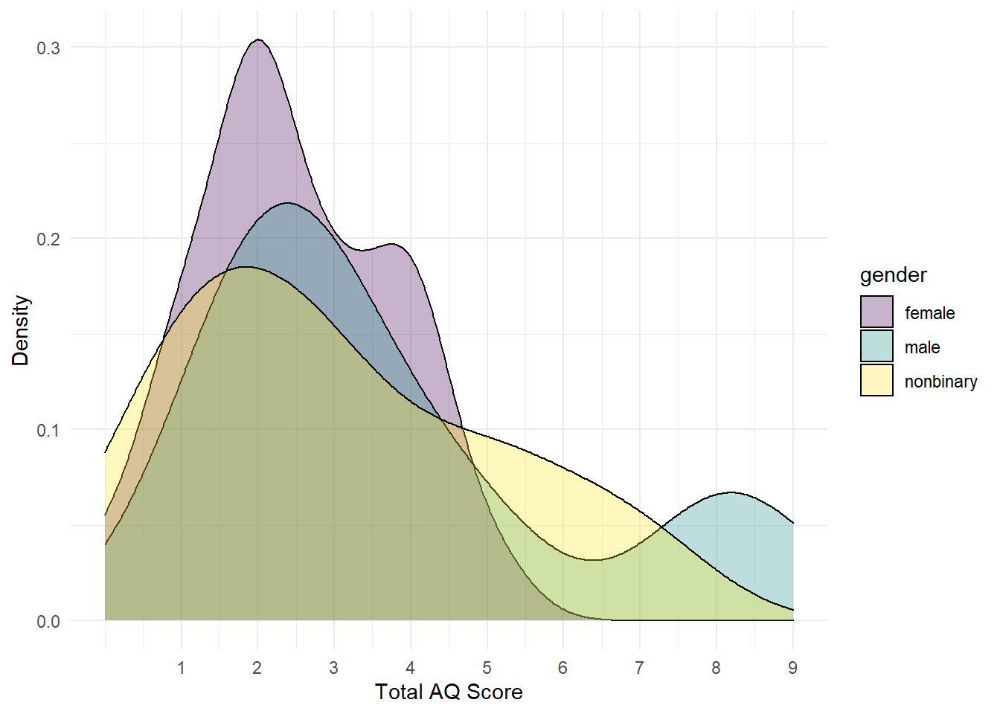

# 1B: Lab 2

## Pre-class activities

### Activity 1: Recap

In Psych 1A we briefly introduced the concept of **pipes**, if you'd like to recap what you did, you can [find it here](https://psyteachr.github.io/ug1-practical/a-lab-3.html#activity-9-pipes). 

Pipes look like this: `%>%`. Pipes allow you to send the output from one function straight into another function. Specifically, they send the result of the function before `%>%` to be the first argument of the function after `%>%`. As usual, it's easier to show, rather than tell so let's look at an example.

In the below example we want to perform some common wrangling steps:

1. Read in the data
2. Select the columns we want to retain
3. Join together our data files
4. Filter out participants so that we just use data from people who are aged 18 years or older

So far, when you've done these steps you've created a new object for each part of the process. The code below should look familiar - once you've loaded in the data to `demographic` and `raw_data`, you then create a new object named `sel_data` that stores the output of the `select()` operation, then you create a new object named `joined_data` that uses `sel_data` as its input and then finally you create another object called `final_data` that uses `joined_data` as its input.


<div class = 'left-float'>

```r
demographic <- read_csv("demographic.csv")
raw_data <- read_csv("my_data.csv")

sel_data <- select(raw_data, id, score)
joined_data <- inner_join(sel_data, demographic, by = "id")
final_data <- filter(joined_data, age >= 18)
```

</div>

This code will work, however, there's a more efficient way of doing all of these steps that needs far less typing which means fewer chances to make typos. Additionally, if you create lots of objects, it increases the chances that you might accidentally use the wrong one (e.g., `rlong` instead of `rlong2`).

By using pipes, we can reduce the amount of code we write and the number of objects we create. 

* Remember, pipes allow you to send the output from one function straight into another function where they are used as the first argument.
* Try and translate the below code into plain English. You can read the `%>%` as **then**.


<div class = 'right-float'>

```r
demographic <- read_csv("demographic.csv")
raw_data <- read_csv("my_data.csv")

final_data <- raw_data %>%
  select(id, score) %>%
  inner_join(demographic, by = "id")
  filter(age >= 18) 
```

</div>


<div class='solution'><button>Solution</button>


Take the object `raw_data` **then** select the columns `id` and `score` **then** join it with the data in `demographic` by `id` **then** filter to only include ages of 18 or greater and save this in an object named `final_data`.


</div>


<br>
Importantly, you don't need to write the entire pipe at once, in fact, it's useful to check that each line works as you intended and then add on the next one to make it easier to spot where errors have come in to your code. 

For example you might start with:


```r
final_data <- raw_data %>%
  select(id, score)
```

Then check the output of `final_data` to make sure that it contains the columns you intended to select. Then you would add on another line of the pipe:


```r
final_data <- raw_data %>%
  select(id, score) %>%
  inner_join(demographic, by = "id")
```

And check the output again to make sure that the join had worked properly before adding on the final line.


```r
final_data <- raw_data %>%
  select(id, score) %>%
  inner_join(demographic, by = "id")
  filter(age >= 18) 
```


<br>
<div class="danger">
<p>As great as pipes are, there are two main cases when it probably makes sense to write your code without pipes, and save the results from each step to separate objects:</p>
<ol style="list-style-type: decimal">
<li><p>When the output from a step partway through your pipeline is somehow useful. For example, you might want to check that a step worked as expected, or the information might be useful again later on.</p></li>
<li><p>When you’re completing assessments and we want you to save the output from a certain step to a specific variable name (we want to check that the step worked properly to be able to give you the mark!).</p></li>
</ol>
</div>

Which of the following is a pipe? <select class='solveme' data-answer='["%>%"]'> <option></option> <option>%<%</option> <option><-</option> <option>%>%</option></select>

Where do pipes send the result of the function that precedes the pipe? <select class='solveme' data-answer='["To the first argument of the next function."]'> <option></option> <option>To the last argument of the next function.</option> <option>To the first argument of the next function.</option> <option>To the third argument of the 18th function.</option></select>

### Activity 2: Set-up

We're going to load in the AQ data to practice some examples.

* Open a new R Markdown document, name it "Lab 2 pre-class" and save it in your Psych 1B folder.
* Make sure the working directory is set to your Psych 1B folder that has the three AQ .csv files.
* Delete the welcome text and insert a new code chunk.
* Copy, paste, and run the below code into the new code chunk.


```r
library(tidyverse)
scoring <- read_csv ("scoring.csv")
responses <- read_csv("responses.csv")
qformats <- read_csv("qformats.csv")
```

### Activity 3: Example pipe 1

Rewrite the below code to use pipes. The solutions are at the bottom but try and work through it on your own - it can be a bit confusing at first but there will be a moment where it suddenly makes sense and you will find it much easier to write code. Remember that if something is difficult it probably means you're learning more.

**Hint 1:** You're not creating new objects so you can delete the intermediate object names and save the output straight into the final object name `scores`.  
**Hint 2:** The point of using pipes is that they pipe the output into the first argument of the next function, in other words, you can delete the first argument of the new function.  
**Hint 3:** Build the pipe up line-by-line and check it at each stage. The output of the first line of the pipe should look like `rlong`, the output of the second line should look like `rlong_join` and so on.


```r
rlong <- pivot_longer(data = responses, 
                      names_to = "Question",  
                      values_to = "Response",
                      cols = Q1:Q10)

rlong_join <- inner_join(rlong, qformats, "Question")

scores <- inner_join(rlong_join, scoring, c("QFormat", "Response"))
```


### Activity 4: Example pipe 2

Rewrite the below code to use pipes. 


```r
data1 <- select(scores, -QFormat)
data2 <- filter(data1, Question == "Q1")
example_2 <- summarise(data2, total_score = sum(Score))
```

### Activity 5: Example pipe 3

You can also pipe into `ggplot()`. The below example calculates the total score for each question (not each participant) by grouping it, then using summarise on the grouped data, then making a graph of these scores so that we can see which question participants were most likely to give an answer indicating autistic traits. Rewrite the below code using pipes.

**Hint 1:** You do not need to save this output to an object.  
**Hint 2:** First, write the code that calculates the scores and then pipe into `gggplot()`  
**Hint 3:** The pipe works exactly the same with `ggplot()`, you can delete the first argument.   


```r
data_group <- group_by(scores, Question)
question_scores <- summarise(data_group, item_scores = sum(Score))

ggplot(question_scores, aes(x = Question, y = item_scores)) +
  geom_col() +
  theme_minimal()
```

<div class="figure" style="text-align: center">

<p class="caption">(\#fig:unnamed-chunk-11)Total scores for each AQ question</p>
</div>

### Activity 6: Reading

You should also read the ethics document which is available in the Lab 2 section of the [1B Practical Moodle](https://moodle.gla.ac.uk/course/view.php?id=17342).

### Activity solutions

#### Activity 3


<div class='solution'><button>Solution</button>


```r
scores <- pivot_longer(data = responses, 
                      names_to = "Question",  
                      values_to = "Response",
                      cols = Q1:Q10) %>%
  inner_join(qformats, "Question") %>%
  inner_join(scoring, c("QFormat", "Response"))

# this also does the same thing but the first line is slightly different

scores <- responses %>%
  pivot_longer(names_to = "Question",  
               values_to = "Response",
               cols = Q1:Q10) %>%
  inner_join(qformats, "Question") %>%
  inner_join(scoring, c("QFormat", "Response"))
```

</div>


#### Activity 4


<div class='solution'><button>Solution</button>


```r
example_2 <- select(scores, -QFormat) %>%
  filter(Question == "Q1") %>%
  summarise(total_score = sum(Score))
```

</div>


#### Activity 5


<div class='solution'><button>Solution</button>


```r
scores %>%
  group_by(Question) %>%
  summarise(item_scores = sum(Score)) %>%
  ggplot(aes(x = Question, y = item_scores)) +
  geom_col() +
  theme_minimal()
```

</div>


## In-class activities

### Activity  1: Set-up 

* Open a new R markdown document, name it "Lab 2 in-class" and save it in your Psych 1B folder.
* Set the working directory to your Psych 1B folder.
* Type and run the code that loads the `tidyverse` package.
* Use `read_csv()` to load in the data. you should create three objects `responses`, `scoring` and `qformats` that contain the respective data.

### Activity 2: Mega pipe

We're going to build on what you learned in the pre-class and rewrite all of the code we did in Lab 1 (which you can see below) using a pipe. As a reminder, the code:

* Transforms the data from wide-form to long-form
* Joins together the three objects by their common columns
* Calculates a total AQ score for each participant


```r
rlong <- pivot_longer(data = responses, 
                      names_to = "Question",  
                      values_to = "Response",
                      cols = Q1:Q10)

rlong_join <- inner_join(rlong, qformats, by = "Question")

scores <- inner_join(rlong_join, scoring, by = c("QFormat", "Response"))

scores_grouped <- group_by(scores, Id, gender)

AQ_all <- summarise(scores_grouped, total_score = sum(Score))
```

* Rewrite the above code using pipes `%>%`. Make sure you have completed the pre-class before you attempt this.

### Activity 3: Pipe plot

Now we've got our total AQ scores, let's use the pipe to make a graph. 

* Take `AQ_all` **then** filter it leaving only female participants **then** use `ggplot()` to create a histogram of the total scores (you did this in [1B Lab 1](https://psyteachr.github.io/ug1-practical/b-lab-1.html#activity-8-visualisation)). If you've done it correctly, it should look like the below (you can change the colours if you like).

<div class="figure" style="text-align: center">

<p class="caption">(\#fig:unnamed-chunk-15)Histogram of scores for female participants</p>
</div>

Remember this for your group project - rather than creating new objects for each graph you want to make you can just pipe the data you want to display straight into `ggplot()`.

### Activity 4: AQ score by gender

[More men and boys are currently diagnosed as autistic than women and girls](https://www.autism.org.uk/about/what-is/gender.aspx) and there is increasing evidence that there is an over-representation of [transgender and nonbinary people](https://www.ncbi.nlm.nih.gov/pubmed/31260907) in those with autism spectrum disorder (ASD) or who meet the AQ cut-off score for ASD, therefore, it seems sensible to visualise AQ scores by gender (note that this dataset is simulated and that whilst the pattern of results is based on what we would expect from the evidence, these are not real data).

* Using the data in `AQ_all`, create a violin-boxplot of the total AQ scores by gender.
* Hint: `gender` should be on the x-axis, `total_score` should be on the y-axis.
* You can use a pipe if you want, but it doesn't make much difference in this activity.

Look at the graph and answer the following questions:

* Which group has the lowest median total AQ score? <select class='solveme' data-answer='["female"]'> <option></option> <option>female</option> <option>male</option> <option>nonbinary</option></select>
* Which group has an outlier? <select class='solveme' data-answer='["male"]'> <option></option> <option>female</option> <option>male</option> <option>nonbinary</option></select>
* Which of the following do you think would be an accurate conclusion to draw from the plot? <select class='solveme' data-answer='["Men and nonbinary people&apos;s scores did not differ much and both had higher AQ scores than women"]'> <option></option> <option>Women had higher AQ scores than men or nonbinary people</option> <option>Men had higher AQ scores than nonbinary people who had higher scores than women</option> <option>Men and nonbinary people's scores did not differ much and both had higher AQ scores than women</option></select>

### Activity 5: Bad bar plots

In the research methods lectures for Psych 1A, we talked about the importance of data visualisation and how different graphs might lead you to make very different conclusions about your data. For this reason, we've taught you how to make violin-boxplots because these show the true distribution of the data, however, it's useful to know how to make bad bar plots so that you can see the difference they make to your own data (but never use them as your only method of visualisation!).

* Copy, paste and run the below code in a new code chunk
* Making a bar chart works a little differently to the other graphs you have made so far. Previously, `ggplot()` has just visualised the raw data, however, for a bar chart you actually want to visualise a summary of the data, e.g., the mean.
* You can read the `stat_summary` code as "draw a summary of the data, use a bar chart to do so and the function to display on the y-axis should be the mean. Then, draw another summary but this time use an errorbar and the function to apply to the data is standard error of the mean".


```r
AQ_all %>%
  ggplot(aes(x = gender, y = total_score)) +
  stat_summary(geom = "bar", fun.y = "mean") +
  stat_summary(geom = "errorbar", fun.data = "mean_se", width = .2) +
  theme_minimal()
```

<div class="figure" style="text-align: center">

<p class="caption">(\#fig:unnamed-chunk-16)Bad bar chart of means</p>
</div>

Think back to your interpretation of the violin-boxplot, that men and nonbinary people's scores did not differ much and both had higher AQ scores than women. Would you have concluded the same thing if you had looked at the bar chart? 

In this dataset, the outlier in the male group results in the mean score being much higher than the nonbinary mean, it's only through looking at the full distribution with the violin-boxplot that you can accurately intepret the data.

### Activity 6: Density plots

The final type of visualiation we're going to show you are density plots as they are a useful way of visualising how the distributions of different groups compare to each other. You've actually already seen a density plot - it's the base of a violin plot, however, it can be useful to overlap them.

* Copy, paste, and run the below code in a new code chunk.
* A lot of this code should be familiar to you, most of it is editing the axis labels and the theme.
* Adding `fill = gender` tells `ggplot` to produce different coloured geoms for each level of `gender`. Try removing `fill = gender` and see what happens to the plot.
* `geom_density()` is our new geom and tells R to draw the density curve. The argument `alpha` controls the transparency of the colours, try adjusting this value.


```r
ggplot(AQ_all, aes(x = total_score, fill = gender)) +
  geom_density(alpha = .3) +
  theme_minimal() +
  scale_fill_viridis_d(option = "D") +
  scale_x_continuous(name = "Total AQ Score", breaks = c(1,2,3,4,5,6,7,8,9,10)) +
  scale_y_continuous(name = "Density")
```

<div class="figure" style="text-align: center">

<p class="caption">(\#fig:unnamed-chunk-17)Grouped density plot</p>
</div>

The y-axis displays density, i.e., what proportion of the data points fall at eaach point on the x-axis.

* Approximately what percent of female participants had a total AQ of 2? <select class='solveme' data-answer='["30%"]'> <option></option> <option>.3%</option> <option>3%</option> <option>30%</option></select>


<div class='solution'><button>Solution</button>


It's important to be able to translate between proportions and percentages, it will make your understanding of statistics and p-values much easier. To translate a proportion into a percentage, you multiply by 100 or move the decimal place two places to the right so a proportion of .5 = 50%, a proportion of .03 = 3% and so on. 

</div>


### Activity 7: Saving plots

Finally, it's useful to be able to save a copy of your plots as an image file so that you can use it in a presentation or word document and to do this we can use the function `ggsave()`.

There are two ways you can use `ggsave()`. If you don't tell `ggsave()` which plot you want to save, by default it will save a copy of **the last plot you created**. If you've been following this chapter in order, the last plot you created should have been the density plot from Activity 6. 

All that `ggsave()` requires is for you to tell it what file name it should save the plot to and the type of image file you want to create (the below example uses .png but you could also use e.g., .jpeg and other image types).

* Copy, paste and run the below code into a new code chunk.
* Check your Psych 1B folder, you should now see the saved image file.


```r
ggsave("density.png")
```

The default size for an image is 7 x 7, you can change this manually if you think that the dimensions of the plot are not correct or if you need a particular size.

* Copy paste and run the below code to overwrite the image file with new dimensions.


```r
ggsave("density.png", width = 10, height = 8)
```

The second way of using `ggsave()` is to save your plot as an object and then tell it which object to write to a file. The below code saves the pipe plot from Activity 3 into an object named `AQ_histogram` and then saves it to an image file "AQ_histogram.png". 

Note that when you save a plot to an object, it won't display in R Studio. To get it to display you need to type the object name in the console (i.e., `AQ_histogram`). The benefit of doing it this way is that if you are making lots of plots, you can't accidentally save the wrong one because you are explicitly specifying which plot to save rather than just saving the last one.

* Copy, paste and run the below code and then check your Psych 1B folder for the image file. Resize the plot if you think it needs it.


```r
AQ_histogram <- AQ_all %>%
  filter(gender == "female") %>%
  ggplot(aes(x = total_score)) +
  geom_histogram(binwidth = 1, colour = "black", fill = "grey") +
  theme_minimal()+
  scale_x_continuous(name = "Total AQ Score (female participants)", breaks = c(0,1,2,3,4,5,6,7,8,9,10)) +
  scale_y_continuous(name = "Count")

ggsave("AQ_histogram.png", plot = AQ_histogram)
```

### Activity solutions


#### Activity 1


<div class='solution'><button>Solution</button>


```r
library(tidyverse)
scoring <- read_csv ("scoring.csv")
responses <- read_csv("responses.csv")
qformats <- read_csv("qformats.csv")
```

</div>


#### Activity 2


<div class='solution'><button>Solution</button>


```r
AQ_all <- pivot_longer(data = responses, 
                      names_to = "Question",  
                      values_to = "Response",
                      cols = Q1:Q10) %>%
  inner_join(qformats, by = "Question") %>%
  inner_join(scoring, by = c("QFormat", "Response")) %>%
  group_by(Id, gender) %>% 
  summarise(total_score = sum(Score))
```

</div>


#### Activity 3


<div class='solution'><button>Solution</button>


```r
AQ_all %>%
  filter(gender == "female") %>%
  ggplot(aes(x = total_score)) +
  geom_histogram(binwidth = 1, colour = "black", fill = "grey") +
  theme_minimal()+
  scale_x_continuous(name = "Total AQ Score (female participants)", breaks = c(0,1,2,3,4,5,6,7,8,9,10)) +
  scale_y_continuous(name = "Count")
```

</div>


#### Activity 4


<div class='solution'><button>Solution</button>


```r
ggplot(AQ_all, aes(gender, total_score)) +
  geom_violin(trim = FALSE) +
  geom_boxplot(width = .2) +
  theme_minimal()
```

</div>

