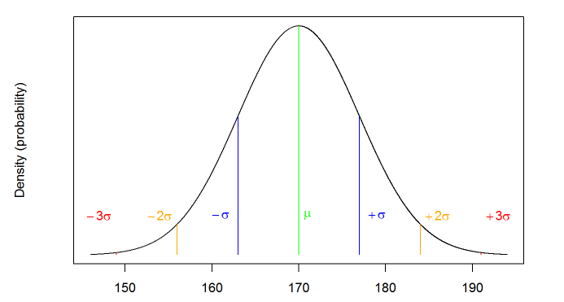

# Lab 8

## Pre-class activity

### Discrete or Continuous Datasets

This is a short tutorial with just a couple of quick questions on how the level of measurement can alter the way in which you tackle probability.

Levels of measurement can be categorised as either discrete or continuous:

**Discrete Data**

**Discrete** data can only take integer values (whole numbers). For example, the number of participants in an experiment would be discrete - we can't have half a participant! Categorical variables, like handedness, can be similarly coded as integers (e.g. right handed = 0, left-handed = 1). Discrete variables can also be further broken down into nominal/categorical and ordinal variables.
* **Nominal/categorical data** is based on a set of categories but the ordering doesn't matter (e.g. left or right handed).
* **Ordinal data** is based on a set of *ordered* categories; you know which is the top/best and which is the worst/lowest, but not the difference between categories. For example, you could ask participants to rate the attractiveness of different faces based on a 5-item Likert scale (very unattractive, unattractive, neutral, attractive, very attractive).

**Continuous Data**

**Continuous** data, on the other hand, can take any numeric value. For example, we can measure age on a continuous scale (e.g. we can have an age of 26.55 years). Other examples include reaction time or the distance you travel to university every day. Continuous variables can be further broken down into interval and ratio variables.
* **Interval** data is data which comes in the form of a numerical value where the difference between points is standardised and meaningful. For example temperature, the difference in temperature between 10-20 degrees is the same as the difference in temperature between 20-30 degrees.
* **Ratio** data is very like interval but has a true zero point. With our interval temperature example above, we have been experiencing negative temperatures (-1,-2 degrees) in Glasgow but with ratio data you don't see negative values such as these i.e. you can't be -10 cm tall.

Here is a video with a useful summary on the differences between discrete and continuous data: [https://youtu.be/6IdJ1aPFDCs](https://youtu.be/6IdJ1aPFDCs).

When you read journal articles or when you are working with data in the lab, it is really good practice to take a minute or two to figure out the type of variables you are reading about and/or working with. We have introduced these concepts in a little more depth as we are moving onto lab 8 and normal distribution probability so this will help with understanding this concept in relation to binomial probability and the different types of data involved.

#### <span style="color:DARKGREEN"> Quickfire Questions</span>

What kinds of data are the following examples of?

* Time taken to run a marathon (in seconds): <select class='solveme' data-answer='["ratio"]'> <option></option> <option>interval</option> <option>categorical</option> <option>ratio</option> <option>ordinal</option></select>
* Finishing position in marathon (e.g. 1st, 2nd, 3rd): <select class='solveme' data-answer='["ordinal"]'> <option></option> <option>interval</option> <option>ratio</option> <option>ordinal</option> <option>categorical</option></select>
* Which Sesame Street character a runner was dressed as: <select class='solveme' data-answer='["categorical"]'> <option></option> <option>ordinal</option> <option>categorical</option> <option>ratio</option> <option>interval</option></select>
* Temperature of a runner dressed in a cookie monster outfit (in degrees Celsius): <select class='solveme' data-answer='["interval"]'> <option></option> <option>interval</option> <option>ratio</option> <option>ordinal</option> <option>categorical</option></select>

### Binomial Distributions Recap

The **binomial distributions** in the previous lab are used for calculating probabilities for situations where there are two possible outcomes. They can tell us, for example, the probability of observing any number of heads occurring if a coin is flipped a given number of times. A binomial distribution models the probability of any number of successes being observed, given the probability of a success and the number of observations.

As the variable of "Number of Successes" is *discrete* (it is a count, so can only be a whole number), we plot the probabilities on a bar plot.

### Introduction to the Normal Distribution

The **normal distribution**, on the other hand, reflects the probability of any value occurring for a *continuous* variable. Examples of continuous variables include height or age, where a single person can score anywhere along a continuum. For example, a person could be 21.5 years old and 176cm tall.

As the normal distribution models the probability of a continuous variable, we plot the probability using a density plot. A normal distribution looks like this:

<div class="figure" style="text-align: center">

<p class="caption">(\#fig:unnamed-chunk-2)Normal Distribution of height. $\mu$ = the mean (average), $\sigma$ = standard deviation</p>
</div>

Normal distributions are symmetrical, meaning there is an equal probability of observations occurring above and below the mean. This means that, if the mean in figure 1 is 170, we could expect the number of people who have a height of 160 to equal the number of people who have a height of 180. This also means that the mean, median, and mode are all expected to be equal in a normal distribution.

As with any probabilities, real-world data will come close to the normal distribution, but will (almost certainly) never match it exactly. As we collect more observations from normally-distributed data, our data will get increasingly closer to a normal distribution. As an example, here's a simulation of an experiment in which we collect heights from 5000 participants. As you can see, as we add more observations, our data starts to look more and more like the normal distribution in the previous figure.

<div class="figure" style="text-align: center">

<p class="caption">(\#fig:unnamed-chunk-3)A simulation of an experiment collecting height data from 2000 participants</p>
</div>

#### <span style="color:DARKGREEN"> Quickfire Questions</span>

Complete the sentences so that they are correct.

* In a normal distribution, the mean, median, and mode <select class='solveme' data-answer='["are all equal"]'> <option></option> <option>are always interval data</option> <option>sum to zero</option> <option>are all equal</option></select>.
* An example of data in which you might expect to see a normal distribution is <select class='solveme' data-answer='["the number of goals scored by Leeds United F.C."]'> <option></option> <option>the number of goals scored by Leeds United F.C.</option> <option>the number of people who are right handed</option> <option>the number of heads observed out of 10 coin flips</option></select>.
* Whereas the binomial distribution is based on situations in which there are two possible outcomes, the normal distribution is based on situations in which the data <select class='solveme' data-answer='["is a continuous variable"]'> <option></option> <option>has three possible values</option> <option>is a categorical variable</option> <option>is a continuous variable</option></select>.

### Working with the Normal Distribution

Just as we used functions to work with the binomial distribution (`dbinom`, `pbinom`, and `qbinom`), a similar set of functions exist to help us work with other distributions, including the normal distribution:

`dnorm()`-the density function, for calculating the probability of a specific value

`pnorm()`-the probability or distribution function, for calculating the probability of getting at least or at most a specific value

`qnorm()`-the quantile function, for calculating the specific value associated with a given probability

As you can probably see, these functions are very similar to the functions we've already come across, that are used to work with the binomial distribution.

We'll go through these concepts in more detail with the in-class activity, but you might want to try this web app, which introduces the functions in more detail:

[Normal Distributions Web App](http://shiny.psy.gla.ac.uk/ShinyPsyTeachR/ug1/normal-distributions/)

## Inclass activity

In lab 7 and the pre lab for this lab you recapped and expanded on your understanding of probability, including a number of `binom` functions as well as some more basic ideas on probability and data types. You will need these skills to complete the following so please make sure you have carried out the pre class on types of data before attempting this. Remember to follow the instructions and if you get stuck at any point to ask the staff member and GTAs to talk you through it.

Staff will talk you through the mean and standard deviations in relation to a normal distribution.

### Working with the Normal Distribution

We won't ask you to create a normal distribution from scratch as it is more complicated than the binomial distribution you estimated in lab 7. Unlike coin flips, the outcome in the normal distribution is not just 50/50. Just as with the binomial distribution (and other distributions) there are functions that allow us to estimate the normal distribution and to ask questions about the distribution. These are:

`dnorm()`-the density function, for calculating the probability of a specific value

`pnorm()`-the probability or distribution function, for calculating the probability of getting at least or at most a specific value

`qnorm()`-the quantile function, for calculating the specific value associated with a given probability

They work in a similar way to their binomial counterparts. If you are unsure about how a function works you can call the help on it by typing in the console, for example, `?dnorm` or `?dnorm()`. In this lab we'll focus on `pnorm()` and `qnorm()`.

As mentioned in the pre-class activity, this interactive web app provides a good introduction to these functions:

[Normal Distributions Web App](http://shiny.psy.gla.ac.uk/ShinyPsyTeachR/ug1/normal-distributions/)

### Probability of Heights

Data from the [Scottish Health Survey (2008)](http://www.scotland.gov.uk/Resource/Doc/286063/0087158.pdf) shows that:

* The average height of a 16-24 year old Scotsman is 176.2 centimetres, with a standard deviation of 6.748.
* The average height of a 16-24 year old Scotswoman is 163.8 cm, with a standard deviation of 6.931.

In this lab we will use this information to calculate the probability of observing at least or at most a specific height with `pnorm()`, and the heights that are associated with specific probabilities with `qnorm()`.

### `pnorm()` - the probability or distribution function

1. What is the probability of meeting a 16-24 y.o. Scotswoman who is
   taller than the average 16-24 y.o. Scotsman?


<div class='solution'><button>Solution</button>


```r
p_taller_w <- pnorm(176.2, 163.8, 6.931, lower.tail = FALSE)
```


</div>


2. Fiona is a very tall Scotswoman (181.12\nbsp{}cm) in the 16-24
   y.o. range who refuses to date men who are shorter than her.  What
   proportion of all 16-24 Scotsmen would she be willing to date?


<div class='solution'><button>Solution</button>


```r
p_taller_m <- pnorm(181.12, 176.2, 6.748, lower.tail = FALSE)
```


</div>


3. Out of 100,000 16-24 y.o. Scotswomen, how many would you predict
   would meet the height eligibility requirement to join the Royal
   Navy (at least 151.5\nbsp{}cm tall)?


<div class='solution'><button>Solution</button>


```r
n_sailors <- 100000 * pnorm(151.5, 163.8, 6.931, lower.tail = FALSE)
```


</div>


### `qnorm()` - the quartile function

Let's use our height example to work with qnorm:

4. How tall would a 16-24 y.o. Scotsman have to be in order to be in
   the top 5% of the height distribution for Scotsmen in his age
   group?


<div class='solution'><button>Solution</button>


```r
height_cutoff <- qnorm(.05, 176.2, 6.748, lower.tail = FALSE)
```


</div>

