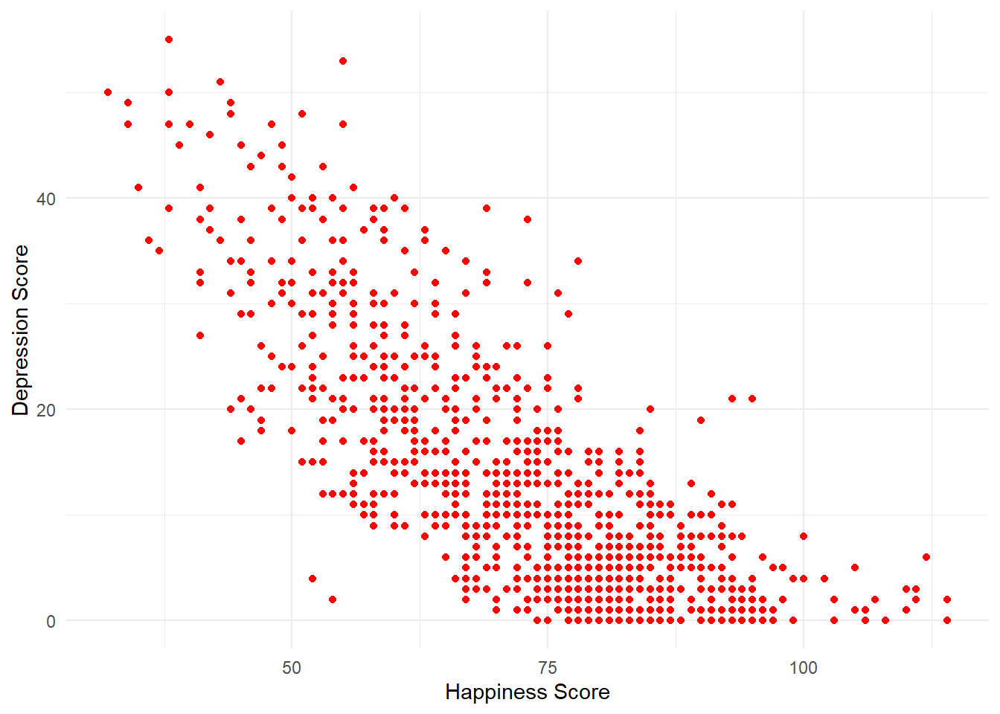

# Scatterplots

In this chapter we will work with our data to generate a plot of two variables from the Woodworth et al. dataset. Before we get to generate our plot, we still need to work through the steps to get the data in the shape we need it to be in for our particular question. In particular we need to generate the object `summarydata` that just has the variable we need.You have done these steps before so go back to the relevant Lab and use that to guide you through. 

### Activity 1: Set-up

* Open R Studio and ensure the environment is clear.  
* Open the `stub-scatterplot.Rmd` file and ensure that the working directory is set to your Data Skills folder and that the two .csv data files (`participant-info.csv` and `ahi-cesd.csv`) are in your working directory (you should see them in the file pane).  
* Look through your previous work to find the code that loads the `tidyverse`, reads in the data files and creates an object called `all_dat` that joins the two objects `dat` and `pinfo`.  


### Activity 2: Select

Select the columns all_dat, ahiTotal, cesdTotal, sex, age, educ, income, occasion, elapsed.days from the data and create an object named variable ```summarydata```. 


### Activity 3: Arrange

Arrange the data in the variable created above (```summarydata```) by ahiTotal with lowest score first and save it in an object named `ahi_asc`.


### Activity 4:Filter

Filter the data ```ahi_asc``` by only keeping those who are 65 years old or younger and save it in an object named `age_65max`.


### Activity 5: Group and summarise

* First, calculate the overall median `ahiTotal` score for all participants (hint: use `summarise()`) and save it in an object called `overall_median`.  
* Then, group the data stored in the variable ```age_65max``` by sex, and store it in ```data_sex```.   
* Then, use summarise to create a new variable ```sex_median```, which calculates the median ahiTotal score for each sex in this grouped data and save it in an object called ```median_score```.

*(Hint: if you're stuck, see [this dplyr documentation](https://dplyr.tidyverse.org/reference/group_by.html)).*


```
## `summarise()` ungrouping output (override with `.groups` argument)
```

### Activity 6: Mutate

Use `mutate()` to create a new column in `data_sex` called Happiness which categorises participants based on whether they score above or below the overall median ahiTotal score (i.e., the median score for all participants, not grouped by sex).


<div class='solution'><button>Hint</button>

mutate(data, new_variable = old_variable > median score

</div>
 


### Activity 7: Scatterplots

In order to visualise two continuous variables, we can use a **scatterplot**. Using the `ggplot` code you learned about in Intro to Data Viz, try and recreate the below plot. 

A few hints:

* Use the `age_65max` data.
* Put `ahiTotal` on the x-axis and `cesdTotal` on the y-axis.
* Rather than using `geom_bar()`, `geom_violin()`, or `geom_boxplot()`, for a scatterplot you need to use `geom_point()`. 
* Rather than using `scale_fill_viridis_d()` to change the colour, add the argument `colour = "red"` to `geom_point` (except replace "red" with whatever colour you'd prefer).
* Remember to edit the axis names.

<div class="figure" style="text-align: center">

<p class="caption">(\#fig:createplot)Scatterplot of happiness and depression scores</p>
</div>

<br>

How would you describe the relationship between the two variables? <select class='solveme' data-answer='["As happiness score increase, depression scores decrease"]'> <option></option> <option>As happiness scores increase, depression scores increase</option> <option>As happiness score increase, depression scores decrease</option> <option>As happiness scores decrease, depression scores decrease</option></select>

#### Finished!

Great job! As you may have noticed, this chapter tried to push you and test what you've learned - we hope you can see just how far you've come in the space of just a couple of months, it's genuinely amazing what you have achieved and you should feel proud. In Psych 1B we will continue using these wrangling skills on new data and also data that you collect yourself.

### Activity solutions - Scatterplots

#### Activity 1


<div class='solution'><button>Solution</button>


```r
library(tidyverse)
dat <- read_csv ('ahi-cesd.csv')
pinfo <- read_csv('participant-info.csv')
all_dat <- inner_join(dat, pinfo, by=c("id", "intervention")
```

</div>


#### Activity 2


<div class='solution'><button>Solution</button>


```r
summarydata <- select(all_dat, ahiTotal, cesdTotal, sex, age, educ, income, occasion, elapsed.days)
```


</div>


#### Activity 3


<div class='solution'><button>Solution</button>


```r
ahi_asc <- arrange(summarydata, by = ahiTotal)
```


</div>


#### Activity 4


<div class='solution'><button>Solution</button>


```r
age_65max <- filter(ahi_asc, age <= 65)
```


</div>


#### Activity 5


<div class='solution'><button>Solution</button>


```r
overall_median <- summarise(age_65max, median_score = median(ahiTotal))
data_sex <- group_by(age_65max, sex)
median_score <- summarise(data_sex, sex_median = median(ahiTotal))
```

```
## `summarise()` ungrouping output (override with `.groups` argument)
```


</div>


#### Activity 6


<div class='solution'><button>Solution</button>


```r
happy <- mutate(data_sex, Happiness = (ahiTotal > 73))
```


</div>


#### Activity 7


<div class='solution'><button>Solution</button>


```r
ggplot(age_65max, aes(x = ahiTotal , y = cesdTotal)) + 
  geom_point(colour = "red") +
  scale_x_continuous(name = "Happiness Score") +
  scale_y_continuous(name = "Depression Score") +
  theme_minimal()
```


</div>


