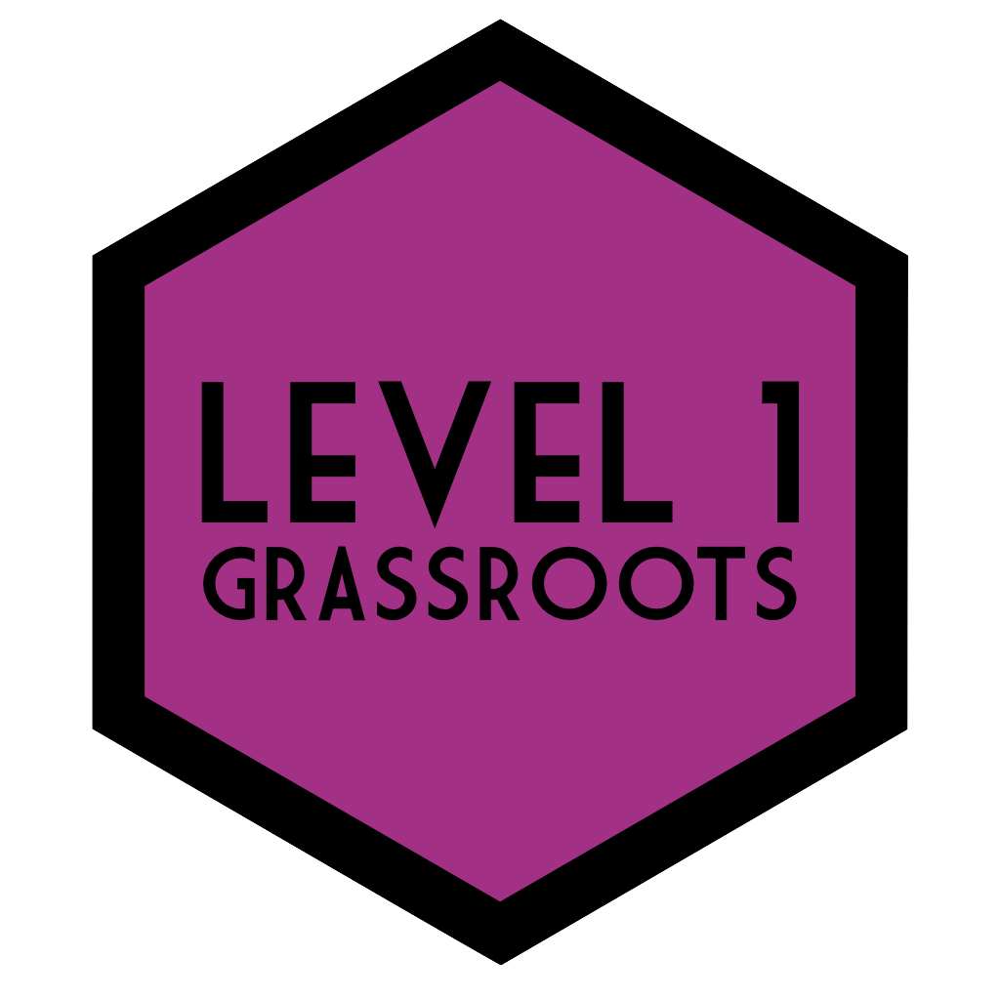

--- 
title: "Level 1 Data Skills"
date: 2019-2020
authors: "Heather Cleland-Woods and Emily Nordmann (emily.nordmann@glasgow.ac.uk)"
site: bookdown::bookdown_site
documentclass: book
bibliography: [book.bib, packages.bib]
biblio-style: apalike
link-citations: yes
description: "ug1-practical-materials"
---

# Course Information {-}

Hello and welcome to Level 1 Psychology at the University of Glasgow! This is the course book for Psych 1A and Psych 1B and will contain almost everything you need for the practical element of the course. We say almost because there's some stuff that we need to host on Moodle for admin reasons, for example, resources related to the lectures and assignment submission links. However, for labs and coursework you should keep this book very close. In fact, it would be a very good idea to save a bookmark for this page to your phone and computer.

For a more general overview of the course including contact details for key staff, University rules and regulations, and how your final course grade will be calculated, please refer to the [Level 1 handbook](https://moodle.gla.ac.uk/mod/resource/view.php?id=1257922).

