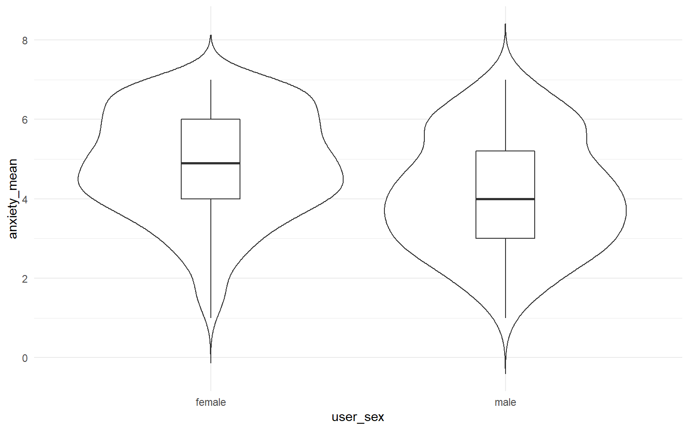
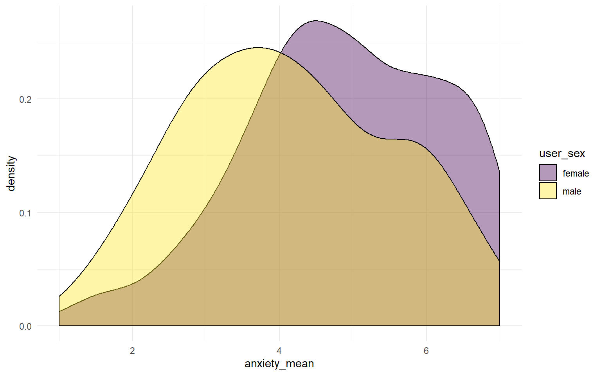
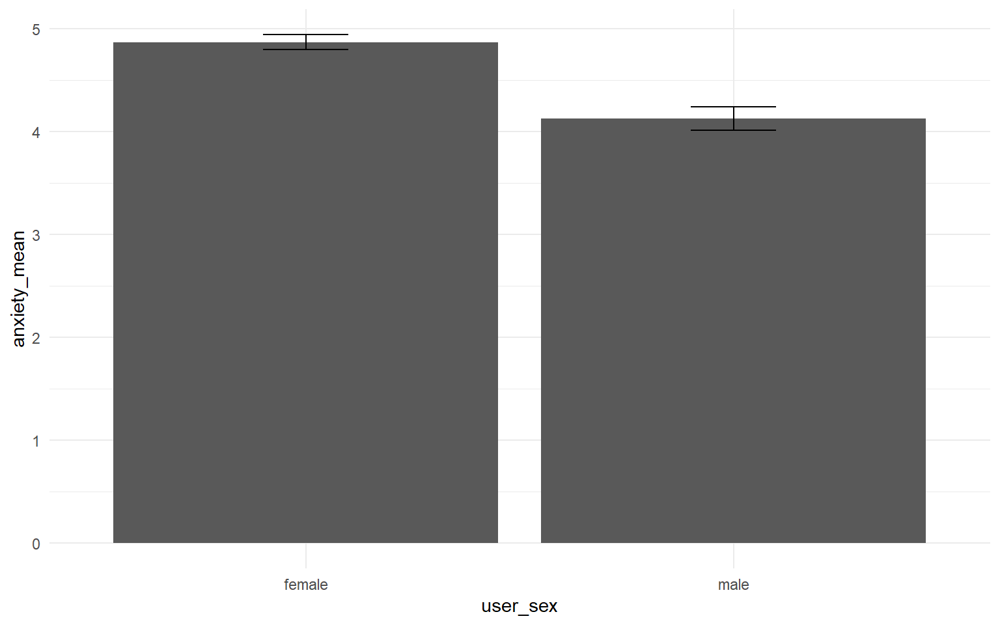
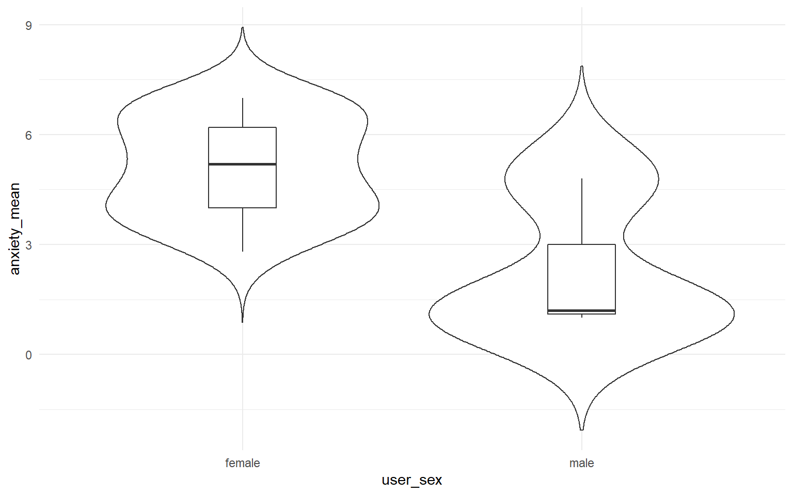
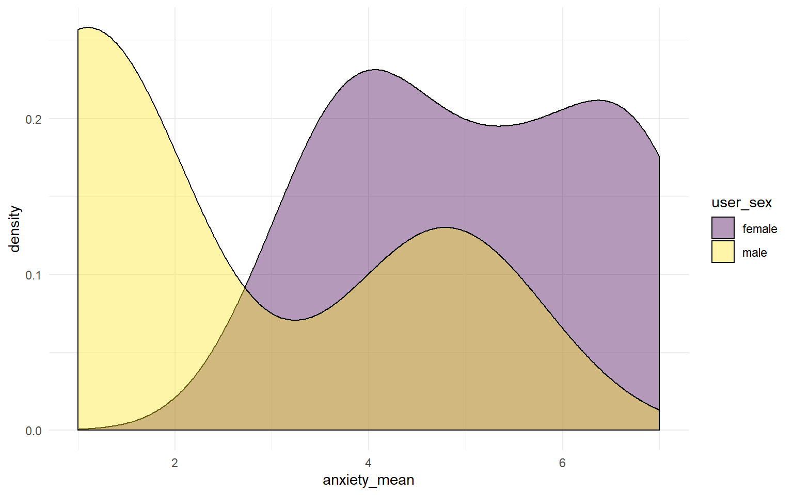
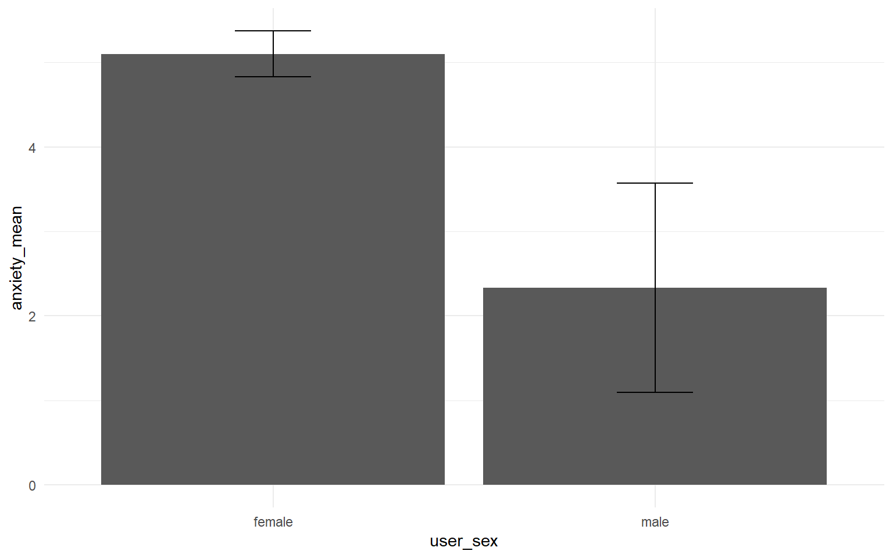

---
title: "1B project example analysis"
author: "Emily Nordmann"
date: "19/02/2020"
output: html_document
---

### Step 1: Load in packages and data


```r
library(tidyverse)

demo <- read_csv("demographics.csv")
mslq <- read_csv("mslq.csv")
teams <- read_csv("team-name.csv")
```

### Step 2: Clean up the data


```r
demo_final <- demo %>% 
  group_by(user_id, q_id) %>% 
  filter(session_id == min(session_id), endtime == min(endtime)) %>% 
  filter(row_number() == 1) %>% 
  ungroup() %>% 
  filter(user_status %in% c("guest", "registered")) %>%
  select(user_id, user_sex, user_age, q_name, dv) %>%
  pivot_wider(names_from = q_name, values_from = dv)%>%
  mutate(employment = as.numeric(employment))

teams_final <- teams %>%
  group_by(user_id, q_id) %>% 
  filter(session_id == min(session_id), endtime == min(endtime)) %>% 
  filter(row_number() == 1) %>% 
  ungroup() %>% 
  filter(user_status %in% c("guest", "registered")) %>%
  select(user_id, user_sex, user_age, dv) %>%
  rename("team" = "dv")
  
mslq_final <- mslq %>% 
  group_by(user_id, q_id) %>% 
  filter(session_id == min(session_id), endtime == min(endtime)) %>% 
  filter(row_number() == 1) %>% 
  ungroup() %>% 
  filter(user_status %in% c("guest", "registered")) %>%
  select(user_id, user_sex, user_age, q_name, dv) %>%
  arrange(q_name) %>%
  pivot_wider(names_from = q_name, values_from = dv)
```

Right. Your turn.

### Step 3: Join 


### Step 4. Select your variables

This example use the anxiety scale and also selects mature student status and employment.


```r
anxiety_dat <- full_dat %>%
  select(user_id, user_sex, user_age,team, mature, anxiety_1:anxiety_5, employment)
```

### Step 5: Recode


```r
summary(anxiety_dat)

anxiety_dat <- anxiety_dat %>%
  mutate(mature = as.factor(mature),
         user_sex = as.factor(user_sex))

summary(anxiety_dat)
```

```
##     user_id        user_sex            user_age         team          
##  Min.   :18932   Length:524         Min.   : 8.00   Length:524        
##  1st Qu.:23423   Class :character   1st Qu.:18.00   Class :character  
##  Median :24075   Mode  :character   Median :19.00   Mode  :character  
##  Mean   :23935                      Mean   :20.72                     
##  3rd Qu.:24432                      3rd Qu.:20.00                     
##  Max.   :24843                      Max.   :56.00                     
##                                     NA's   :7                         
##     mature            anxiety_1       anxiety_2       anxiety_3    
##  Length:524         Min.   :1.000   Min.   :1.000   Min.   :1.000  
##  Class :character   1st Qu.:3.000   1st Qu.:3.000   1st Qu.:4.000  
##  Mode  :character   Median :4.000   Median :5.000   Median :6.000  
##                     Mean   :4.317   Mean   :4.608   Mean   :5.278  
##                     3rd Qu.:6.000   3rd Qu.:6.000   3rd Qu.:7.000  
##                     Max.   :7.000   Max.   :7.000   Max.   :7.000  
##                                     NA's   :3       NA's   :3      
##    anxiety_4       anxiety_5       employment    
##  Min.   :1.000   Min.   :1.000   Min.   : 0.000  
##  1st Qu.:3.000   1st Qu.:3.000   1st Qu.: 0.000  
##  Median :5.000   Median :5.000   Median : 0.000  
##  Mean   :4.461   Mean   :4.573   Mean   : 6.101  
##  3rd Qu.:6.000   3rd Qu.:6.000   3rd Qu.:11.000  
##  Max.   :7.000   Max.   :7.000   Max.   :59.000  
##  NA's   :3                       NA's   :1       
##     user_id           user_sex      user_age         team          
##  Min.   :18932   female   :346   Min.   : 8.00   Length:524        
##  1st Qu.:23423   male     :157   1st Qu.:18.00   Class :character  
##  Median :24075   na       :  3   Median :19.00   Mode  :character  
##  Mean   :23935   nonbinary:  8   Mean   :20.72                     
##  3rd Qu.:24432   NA's     : 10   3rd Qu.:20.00                     
##  Max.   :24843                   Max.   :56.00                     
##                                  NA's   :7                         
##   mature      anxiety_1       anxiety_2       anxiety_3    
##  1   : 71   Min.   :1.000   Min.   :1.000   Min.   :1.000  
##  2   :406   1st Qu.:3.000   1st Qu.:3.000   1st Qu.:4.000  
##  3   : 43   Median :4.000   Median :5.000   Median :6.000  
##  NULL:  4   Mean   :4.317   Mean   :4.608   Mean   :5.278  
##             3rd Qu.:6.000   3rd Qu.:6.000   3rd Qu.:7.000  
##             Max.   :7.000   Max.   :7.000   Max.   :7.000  
##                             NA's   :3       NA's   :3      
##    anxiety_4       anxiety_5       employment    
##  Min.   :1.000   Min.   :1.000   Min.   : 0.000  
##  1st Qu.:3.000   1st Qu.:3.000   1st Qu.: 0.000  
##  Median :5.000   Median :5.000   Median : 0.000  
##  Mean   :4.461   Mean   :4.573   Mean   : 6.101  
##  3rd Qu.:6.000   3rd Qu.:6.000   3rd Qu.:11.000  
##  Max.   :7.000   Max.   :7.000   Max.   :59.000  
##  NA's   :3                       NA's   :1
```

### Step 6: Filter

This example filters sex to only include binary gender and also provides the code for how to create a new variable for employment.


```r
anxiety_filter <- anxiety_dat %>%
  filter(user_sex %in% c("male", "female")) %>%
  mutate(employed = (employment > 0))
```

### Step 7: Sub-scale scores


```r
dat_means <- anxiety_filter %>% #
  pivot_longer(names_to = "var", values_to = "val", anxiety_1:anxiety_5) %>% 
  group_by_at(vars(-val, -var)) %>% 
  summarise(anxiety_mean = mean(val, na.rm = TRUE)) %>%  
  ungroup()
```

### Step 8: Split the dataset


```r
dat_means_team <- dat_means %>%
  filter(team == 7)
```

### Step 9: Demoraphic information 

This example shows how to do the code for the overall dataset. They also need to repeat this code but using their team dataset.


```r
# count the total number of participants in the dataset

dat_means %>%
  count()

# count the number of responses to each level of user_sex (for gender)
dat_means %>%
  group_by(user_sex) %>%
  count()

# count the number of responses to each level of mature student status (you may need to change this variable to the one you're using)
dat_means %>%
  group_by(mature) %>%
  count()

# count the number of responses across two categories (you might not need or want to do this)
dat_means %>%
  group_by(user_sex,mature) %>%
  count()
```

```
## # A tibble: 1 x 1
##       n
##   <int>
## 1   503
## # A tibble: 2 x 2
## # Groups:   user_sex [2]
##   user_sex     n
##   <fct>    <int>
## 1 female     346
## 2 male       157
## # A tibble: 4 x 2
## # Groups:   mature [4]
##   mature     n
##   <fct>  <int>
## 1 1         65
## 2 2        392
## 3 3         42
## 4 NULL       4
## # A tibble: 7 x 3
## # Groups:   user_sex, mature [7]
##   user_sex mature     n
##   <fct>    <fct>  <int>
## 1 female   1         41
## 2 female   2        270
## 3 female   3         31
## 4 female   NULL       4
## 5 male     1         24
## 6 male     2        122
## 7 male     3         11
```

Once you've done this you might realise that you have participants in the dataset that shouldn't be there. For example, you might have people who have answered "Not applicable" to the mature student question, or you might have some NAs (missing data from when people didn't respond). 

You need to think about whether you need to get rid of any observationse from your dataset. For example, if you're looking at gender differences, then you can't have people who are missing gender information. You may have said in your pre-reg that you would only include non-binary people if they made up a certain proportion of the data. If you're looking at mature student status, you can't have people who didn't answer the question or who said not applicable (i.e., postgrad students). You need to decide whether any of this is a problem, and potentially go back and add in an extra filter to step 6.


```r
dat_means %>%
  summarise(mean_age = mean(user_age, na.rm = TRUE),
            sd_age = sd(user_age, na.rm = TRUE))

dat_means_team %>%
  summarise(mean_age = mean(user_age, na.rm = TRUE),
            sd_age = sd(user_age, na.rm = TRUE))
```

```
## # A tibble: 1 x 2
##   mean_age sd_age
##      <dbl>  <dbl>
## 1     20.7   5.47
## # A tibble: 1 x 2
##   mean_age sd_age
##      <dbl>  <dbl>
## 1     24.2   9.55
```

### Step 10: Descriptive statistics

Use summarise and group_by to calculate the mean, median, and standard deviation of the sub-scale scores for each group. Do this separately for the full dataset and your team dataset.


```r
dat_means %>%
  group_by(mature) %>%
  summarise(mean = mean(anxiety_mean),
            median = median(anxiety_mean),
            sd = sd(anxiety_mean))

dat_means_team %>%
  group_by(mature) %>%
  summarise(mean = mean(anxiety_mean),
            median = median(anxiety_mean),
            sd = sd(anxiety_mean))
```

```
## # A tibble: 4 x 4
##   mature  mean median    sd
##   <fct>  <dbl>  <dbl> <dbl>
## 1 1       4.28    4.2 1.82 
## 2 2       4.69    4.8 1.36 
## 3 3       4.70    4.5 1.18 
## 4 NULL    4.65    4.6 0.661
## # A tibble: 3 x 4
##   mature  mean median    sd
##   <fct>  <dbl>  <dbl> <dbl>
## 1 1       3.7     4.1  2.26
## 2 2       5.25    5.2  1.33
## 3 3       4.17    3.5  1.42
```


### Step 10: visualisation

You now need to create a bar chart with error bars, a violin-boxplot and a grouped density plot for both the full dataset and your team dataset. You've done all of these before, just find a previous example code and change the variables and axis labels.


```r
ggplot(dat_means, aes(x = user_sex, y = anxiety_mean)) +
  geom_violin(trim = FALSE) +
  geom_boxplot(width = .2) +
  theme_minimal()
```

<div class="figure" style="text-align: center">

<p class="caption">(\#fig:unnamed-chunk-131)**CAPTION THIS FIGURE!!**</p>
</div>

```r
ggplot(dat_means, aes(x = anxiety_mean, fill = user_sex)) +
  geom_density(alpha = .4) +
  scale_fill_viridis_d() +
  theme_minimal()
```

<div class="figure" style="text-align: center">

<p class="caption">(\#fig:unnamed-chunk-132)**CAPTION THIS FIGURE!!**</p>
</div>

```r
dat_means %>%
  ggplot(aes(x = user_sex, y = anxiety_mean)) +
  stat_summary(geom = "bar", fun.y = "mean") +
  stat_summary(geom = "errorbar", fun.data = "mean_se", width = .2) +
  theme_minimal()
```

<div class="figure" style="text-align: center">

<p class="caption">(\#fig:unnamed-chunk-133)**CAPTION THIS FIGURE!!**</p>
</div>


```r
ggplot(dat_means_team, aes(x = user_sex, y = anxiety_mean)) +
  geom_violin(trim = FALSE) +
  geom_boxplot(width = .2) +
  theme_minimal()
```

<div class="figure" style="text-align: center">

<p class="caption">(\#fig:unnamed-chunk-141)**CAPTION THIS FIGURE!!**</p>
</div>

```r
ggplot(dat_means_team, aes(x = anxiety_mean, fill = user_sex)) +
  geom_density(alpha = .4) +
  scale_fill_viridis_d() +
  theme_minimal()
```

<div class="figure" style="text-align: center">

<p class="caption">(\#fig:unnamed-chunk-142)**CAPTION THIS FIGURE!!**</p>
</div>

```r
dat_means_team %>%
  ggplot(aes(x = user_sex, y = anxiety_mean)) +
  stat_summary(geom = "bar", fun.y = "mean") +
  stat_summary(geom = "errorbar", fun.data = "mean_se", width = .2) +
  theme_minimal()
```

<div class="figure" style="text-align: center">

<p class="caption">(\#fig:unnamed-chunk-143)**CAPTION THIS FIGURE!!**</p>
</div>


